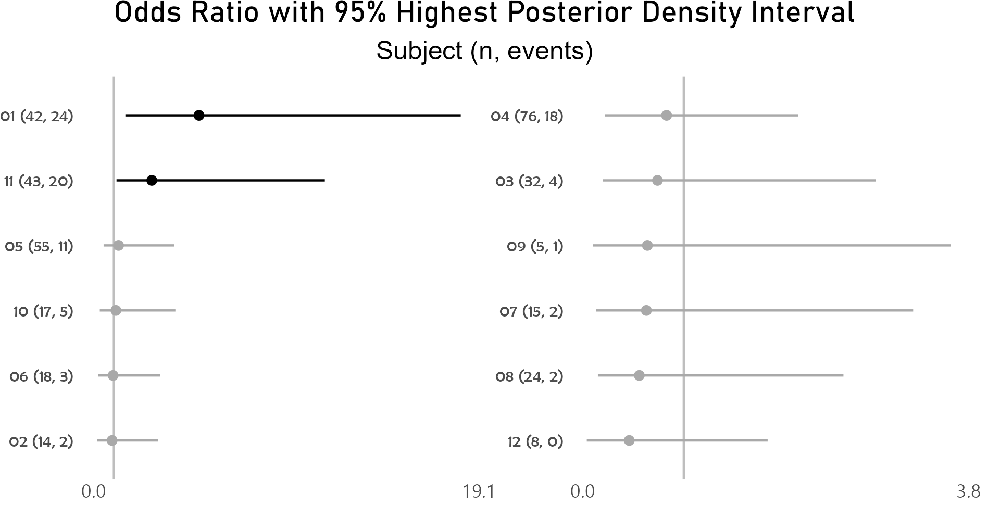
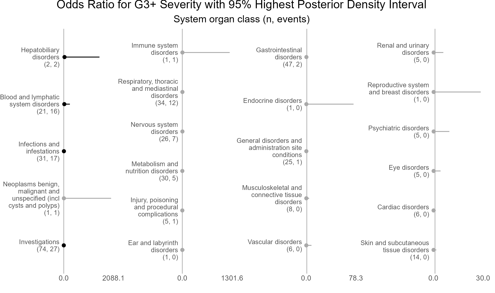

<!-- This file is used to create README.md
Note that the README.md document may need updating to change
'\<0.001' to '<0.001'. 
-->

# BiostatsUHNplus

<!-- badges: start -->

[](https://lifecycle.r-lib.org/articles/stages.html#stable)
[](https://CRAN.R-project.org/package=BiostatsUHNplus)
[](https://cran.r-project.org/package=BiostatsUHNplus)
<!-- badges: end -->

The goal of **BiostatsUHNplus** is to house publicly available code
snippets and functions (some with multiple package dependencies) used by
[Biostatistics@UHN](https://biostats.uhnresearch.ca/) in Toronto,
Canada.

Many of these functions build upon the features of
[**reportRmd**](https://github.com/biostatsPMH/reportRmd).

## Installation

First, install the latest version of **reportRmd** from
[CRAN](https://cran.r-project.org/package=reportRmd) with:

``` r
install.packages(c("reportRmd"), dependencies=TRUE);
```

Then install the latest version of **BiostatsUHNplus** from
[CRAN](https://cran.r-project.org/package=BiostatsUHNplus) with:

``` r
install.packages(c("BiostatsUHNplus"), dependencies=TRUE);
```

If version 0.1.0 or higher of **reportRmd** is installed, the
development version of **BiostatsUHNplus** can be installed from
[GitHub](https://github.com/) with:

``` r
# install.packages("devtools")
devtools::install_github("biostatsPMH/BiostatsUHNplus", ref="development")
```

## Documentation

[Online Documentation](https://biostatsPMH.github.io/BiostatsUHNplus/)

## Examples

### A wrapper for the as.numeric function. Prints entries that fail to parse instead of throwing uninformative error

``` r
library(BiostatsUHNplus);
z <- as_numeric_parse(c(1:5, "String1",6:10,"String2"))
#> The following entries were converted to NA values:
#> Entry 6, 'String1'
#> Entry 12, 'String2'
z
#>  [1]  1  2  3  4  5 NA  6  7  8  9 10 NA
```

### Nested summary of adverse events by participant in cohort, stratified by attribution to first study drug

Uses addendum simulated study data and applies variable labels.
Interpret summary output and unnested or nested p-value with caution!

Note that if participants were enrolled in more than one cohort
(crossover), or if repeat AEs in participant had different attribution,
the total N for Full Sample will be less than that of the total N of
attribution for first study drug. Since total N for Full Sample (234) is
less than total N of the first study drug attribution categories (49 +
198), this suggests that there was instances of repeat AEs in
participants having different attribution to first study drug.

``` r
library(plyr);
library(BiostatsUHNplus);

data("enrollment", "demography", "ineligibility", "ae");
clinT <- plyr::join_all(list(enrollment, demography, ineligibility, ae), 
  by = "Subject", type = "full");
clinT$AE_SEV_GD <- as.numeric(clinT$AE_SEV_GD);
clinT$Drug_1_Attribution <- "Unrelated";
clinT$Drug_1_Attribution[clinT$CTC_AE_ATTR_SCALE %in% 
                           c("Definite", "Probable", "Possible")] <- "Related";
clinT$Drug_2_Attribution <- "Unrelated";
clinT$Drug_2_Attribution[clinT$CTC_AE_ATTR_SCALE_1 %in% 
                           c("Definite", "Probable", "Possible")] <- "Related";
lbls <- data.frame(c1=c("AE_SEV_GD", "ENROL_DATE_INT", "COHORT", "GENDER_CODE", 
  "INELIGIBILITY_STATUS", "AE_ONSET_DT_INT", "Drug_2_Attribution", "ae_category"),
  c2=c("Adverse event severity grade", "Enrollment date", "Cohort", "Gender", 
       "Ineligibility", "Adverse event onset date", "Attribution to second study drug",
       "Adverse event system organ class"));
clinT <- reportRmd::set_labels(clinT, lbls);

rm_covsum_nested(data = clinT, id = c("ae_detail", "Subject", "COHORT"), 
  covs = c("COHORT", "GENDER_CODE", "INELIGIBILITY_STATUS", "ENROL_DATE_INT", 
           "AE_SEV_GD", "Drug_2_Attribution", "AE_ONSET_DT_INT", "ae_category"), 
  maincov = "Drug_1_Attribution", nicenames = TRUE);
```

<table class="table table" style="margin-left: auto; margin-right: auto; margin-left: auto; margin-right: auto;">
<thead>
<tr>
<th style="text-align:left;position: sticky; top:0; background-color: #FFFFFF;">
</th>
<th style="text-align:right;position: sticky; top:0; background-color: #FFFFFF;">
Full Sample (n=234)
</th>
<th style="text-align:right;position: sticky; top:0; background-color: #FFFFFF;">
Related (n=49)
</th>
<th style="text-align:right;position: sticky; top:0; background-color: #FFFFFF;">
Unrelated (n=198)
</th>
<th style="text-align:right;position: sticky; top:0; background-color: #FFFFFF;">
Unnested p-value
</th>
<th style="text-align:right;position: sticky; top:0; background-color: #FFFFFF;">
Unnested Effect Size
</th>
<th style="text-align:right;position: sticky; top:0; background-color: #FFFFFF;">
Unnested StatTest
</th>
<th style="text-align:right;position: sticky; top:0; background-color: #FFFFFF;">
Nested p-value
</th>
</tr>
</thead>
<tbody>
<tr>
<td style="text-align:left;">
<span style="font-weight: bold;">Cohort</span>
</td>
<td style="text-align:right;">
</td>
<td style="text-align:right;">
</td>
<td style="text-align:right;">
</td>
<td style="text-align:right;">
0.65
</td>
<td style="text-align:right;">
0.081
</td>
<td style="text-align:right;">
Chi Sq, Cramer’s V
</td>
<td style="text-align:right;">
0.95
</td>
</tr>
<tr>
<td style="text-align:left;padding-left: 2em;" indentlevel="1">
Cohort A
</td>
<td style="text-align:right;">
59 (25)
</td>
<td style="text-align:right;">
13 (27)
</td>
<td style="text-align:right;">
49 (25)
</td>
<td style="text-align:right;">
</td>
<td style="text-align:right;">
</td>
<td style="text-align:right;">
</td>
<td style="text-align:right;">
</td>
</tr>
<tr>
<td style="text-align:left;padding-left: 2em;" indentlevel="1">
Cohort B
</td>
<td style="text-align:right;">
83 (35)
</td>
<td style="text-align:right;">
14 (29)
</td>
<td style="text-align:right;">
74 (37)
</td>
<td style="text-align:right;">
</td>
<td style="text-align:right;">
</td>
<td style="text-align:right;">
</td>
<td style="text-align:right;">
</td>
</tr>
<tr>
<td style="text-align:left;padding-left: 2em;" indentlevel="1">
Cohort C
</td>
<td style="text-align:right;">
37 (16)
</td>
<td style="text-align:right;">
10 (20)
</td>
<td style="text-align:right;">
30 (15)
</td>
<td style="text-align:right;">
</td>
<td style="text-align:right;">
</td>
<td style="text-align:right;">
</td>
<td style="text-align:right;">
</td>
</tr>
<tr>
<td style="text-align:left;padding-left: 2em;" indentlevel="1">
Cohort D
</td>
<td style="text-align:right;">
55 (24)
</td>
<td style="text-align:right;">
12 (24)
</td>
<td style="text-align:right;">
45 (23)
</td>
<td style="text-align:right;">
</td>
<td style="text-align:right;">
</td>
<td style="text-align:right;">
</td>
<td style="text-align:right;">
</td>
</tr>
<tr>
<td style="text-align:left;">
<span style="font-weight: bold;">Gender</span>
</td>
<td style="text-align:right;">
</td>
<td style="text-align:right;">
</td>
<td style="text-align:right;">
</td>
<td style="text-align:right;">
0.14
</td>
<td style="text-align:right;">
0.093
</td>
<td style="text-align:right;">
Chi Sq, Cramer’s V
</td>
<td style="text-align:right;">
0.63
</td>
</tr>
<tr>
<td style="text-align:left;padding-left: 2em;" indentlevel="1">
Female
</td>
<td style="text-align:right;">
51 (22)
</td>
<td style="text-align:right;">
15 (31)
</td>
<td style="text-align:right;">
39 (20)
</td>
<td style="text-align:right;">
</td>
<td style="text-align:right;">
</td>
<td style="text-align:right;">
</td>
<td style="text-align:right;">
</td>
</tr>
<tr>
<td style="text-align:left;padding-left: 2em;" indentlevel="1">
Male
</td>
<td style="text-align:right;">
183 (78)
</td>
<td style="text-align:right;">
34 (69)
</td>
<td style="text-align:right;">
159 (80)
</td>
<td style="text-align:right;">
</td>
<td style="text-align:right;">
</td>
<td style="text-align:right;">
</td>
<td style="text-align:right;">
</td>
</tr>
<tr>
<td style="text-align:left;">
<span style="font-weight: bold;">Ineligibility</span>
</td>
<td style="text-align:right;">
</td>
<td style="text-align:right;">
</td>
<td style="text-align:right;">
</td>
<td style="text-align:right;">
</td>
<td style="text-align:right;">
</td>
<td style="text-align:right;">
Chi Sq, Cramer’s V
</td>
<td style="text-align:right;">
</td>
</tr>
<tr>
<td style="text-align:left;padding-left: 2em;" indentlevel="1">
No
</td>
<td style="text-align:right;">
215 (100)
</td>
<td style="text-align:right;">
46 (100)
</td>
<td style="text-align:right;">
181 (100)
</td>
<td style="text-align:right;">
</td>
<td style="text-align:right;">
</td>
<td style="text-align:right;">
</td>
<td style="text-align:right;">
</td>
</tr>
<tr>
<td style="text-align:left;padding-left: 2em;" indentlevel="1">
Missing
</td>
<td style="text-align:right;">
19
</td>
<td style="text-align:right;">
3
</td>
<td style="text-align:right;">
17
</td>
<td style="text-align:right;">
</td>
<td style="text-align:right;">
</td>
<td style="text-align:right;">
</td>
<td style="text-align:right;">
</td>
</tr>
<tr>
<td style="text-align:left;">
<span style="font-weight: bold;">Enrollment date</span>
</td>
<td style="text-align:right;">
</td>
<td style="text-align:right;">
</td>
<td style="text-align:right;">
</td>
<td style="text-align:right;">
</td>
<td style="text-align:right;">
</td>
<td style="text-align:right;">
Wilcoxon Rank Sum, Wilcoxon r
</td>
<td style="text-align:right;">
</td>
</tr>
<tr>
<td style="text-align:left;padding-left: 2em;" indentlevel="1">
Mean (sd)
</td>
<td style="text-align:right;">
2017-01-07 (301.8 days)
</td>
<td style="text-align:right;">
2017-01-31 (322.7 days)
</td>
<td style="text-align:right;">
2016-12-28 (294.3 days)
</td>
<td style="text-align:right;">
</td>
<td style="text-align:right;">
</td>
<td style="text-align:right;">
</td>
<td style="text-align:right;">
</td>
</tr>
<tr>
<td style="text-align:left;padding-left: 2em;" indentlevel="1">
Median (Min,Max)
</td>
<td style="text-align:right;">
2016-09-14 (2016-01-18, 2018-05-16)
</td>
<td style="text-align:right;">
2017-02-07 (2016-01-18, 2018-05-16)
</td>
<td style="text-align:right;">
2016-09-14 (2016-01-18, 2018-05-16)
</td>
<td style="text-align:right;">
</td>
<td style="text-align:right;">
</td>
<td style="text-align:right;">
</td>
<td style="text-align:right;">
</td>
</tr>
<tr>
<td style="text-align:left;">
<span style="font-weight: bold;">Adverse event severity grade</span>
</td>
<td style="text-align:right;">
</td>
<td style="text-align:right;">
</td>
<td style="text-align:right;">
</td>
<td style="text-align:right;">
0.12
</td>
<td style="text-align:right;">
0.098
</td>
<td style="text-align:right;">
Wilcoxon Rank Sum, Wilcoxon r
</td>
<td style="text-align:right;">
0.97
</td>
</tr>
<tr>
<td style="text-align:left;padding-left: 2em;" indentlevel="1">
Mean (sd)
</td>
<td style="text-align:right;">
1.8 (0.8)
</td>
<td style="text-align:right;">
2.0 (0.9)
</td>
<td style="text-align:right;">
1.7 (0.8)
</td>
<td style="text-align:right;">
</td>
<td style="text-align:right;">
</td>
<td style="text-align:right;">
</td>
<td style="text-align:right;">
</td>
</tr>
<tr>
<td style="text-align:left;padding-left: 2em;" indentlevel="1">
Median (Min,Max)
</td>
<td style="text-align:right;">
1.5 (1.0, 5.0)
</td>
<td style="text-align:right;">
2 (1, 4)
</td>
<td style="text-align:right;">
1.5 (1.0, 5.0)
</td>
<td style="text-align:right;">
</td>
<td style="text-align:right;">
</td>
<td style="text-align:right;">
</td>
<td style="text-align:right;">
</td>
</tr>
<tr>
<td style="text-align:left;">
<span style="font-weight: bold;">Attribution to second study drug</span>
</td>
<td style="text-align:right;">
</td>
<td style="text-align:right;">
</td>
<td style="text-align:right;">
</td>
<td style="text-align:right;">
<span style="font-weight: bold;">\<0.001</span>
</td>
<td style="text-align:right;">
0.55
</td>
<td style="text-align:right;">
Chi Sq, Cramer’s V
</td>
<td style="text-align:right;">
<span style="font-weight: bold;">\<0.001</span>
</td>
</tr>
<tr>
<td style="text-align:left;padding-left: 2em;" indentlevel="1">
Related
</td>
<td style="text-align:right;">
37 (16)
</td>
<td style="text-align:right;">
28 (57)
</td>
<td style="text-align:right;">
11 (6)
</td>
<td style="text-align:right;">
</td>
<td style="text-align:right;">
</td>
<td style="text-align:right;">
</td>
<td style="text-align:right;">
</td>
</tr>
<tr>
<td style="text-align:left;padding-left: 2em;" indentlevel="1">
Unrelated
</td>
<td style="text-align:right;">
197 (84)
</td>
<td style="text-align:right;">
21 (43)
</td>
<td style="text-align:right;">
187 (94)
</td>
<td style="text-align:right;">
</td>
<td style="text-align:right;">
</td>
<td style="text-align:right;">
</td>
<td style="text-align:right;">
</td>
</tr>
<tr>
<td style="text-align:left;">
<span style="font-weight: bold;">Adverse event onset date</span>
</td>
<td style="text-align:right;">
</td>
<td style="text-align:right;">
</td>
<td style="text-align:right;">
</td>
<td style="text-align:right;">
</td>
<td style="text-align:right;">
</td>
<td style="text-align:right;">
Wilcoxon Rank Sum, Wilcoxon r
</td>
<td style="text-align:right;">
</td>
</tr>
<tr>
<td style="text-align:left;padding-left: 2em;" indentlevel="1">
Mean (sd)
</td>
<td style="text-align:right;">
2017-11-03 (161.1 days)
</td>
<td style="text-align:right;">
2017-10-01 (146.6 days)
</td>
<td style="text-align:right;">
2017-11-10 (161.2 days)
</td>
<td style="text-align:right;">
</td>
<td style="text-align:right;">
</td>
<td style="text-align:right;">
</td>
<td style="text-align:right;">
</td>
</tr>
<tr>
<td style="text-align:left;padding-left: 2em;" indentlevel="1">
Median (Min,Max)
</td>
<td style="text-align:right;">
2017-10-05 (2016-05-02, 2019-01-13)
</td>
<td style="text-align:right;">
2017-09-07 (2017-03-18, 2018-11-24)
</td>
<td style="text-align:right;">
2017-10-15 (2016-05-02, 2019-01-13)
</td>
<td style="text-align:right;">
</td>
<td style="text-align:right;">
</td>
<td style="text-align:right;">
</td>
<td style="text-align:right;">
</td>
</tr>
<tr>
<td style="text-align:left;">
<span style="font-weight: bold;">Adverse event system organ class</span>
</td>
<td style="text-align:right;">
</td>
<td style="text-align:right;">
</td>
<td style="text-align:right;">
</td>
<td style="text-align:right;">
<span style="font-weight: bold;">0.003</span>
</td>
<td style="text-align:right;">
0.42
</td>
<td style="text-align:right;">
Chi Sq, Cramer’s V
</td>
<td style="text-align:right;">
1.00
</td>
</tr>
<tr>
<td style="text-align:left;padding-left: 2em;" indentlevel="1">
Blood and lymphatic system disorders
</td>
<td style="text-align:right;">
15 (6)
</td>
<td style="text-align:right;">
6 (12)
</td>
<td style="text-align:right;">
10 (5)
</td>
<td style="text-align:right;">
</td>
<td style="text-align:right;">
</td>
<td style="text-align:right;">
</td>
<td style="text-align:right;">
</td>
</tr>
<tr>
<td style="text-align:left;padding-left: 2em;" indentlevel="1">
Cardiac disorders
</td>
<td style="text-align:right;">
6 (3)
</td>
<td style="text-align:right;">
0 (0)
</td>
<td style="text-align:right;">
6 (3)
</td>
<td style="text-align:right;">
</td>
<td style="text-align:right;">
</td>
<td style="text-align:right;">
</td>
<td style="text-align:right;">
</td>
</tr>
<tr>
<td style="text-align:left;padding-left: 2em;" indentlevel="1">
Ear and labyrinth disorders
</td>
<td style="text-align:right;">
1 (0)
</td>
<td style="text-align:right;">
0 (0)
</td>
<td style="text-align:right;">
1 (1)
</td>
<td style="text-align:right;">
</td>
<td style="text-align:right;">
</td>
<td style="text-align:right;">
</td>
<td style="text-align:right;">
</td>
</tr>
<tr>
<td style="text-align:left;padding-left: 2em;" indentlevel="1">
Endocrine disorders
</td>
<td style="text-align:right;">
1 (0)
</td>
<td style="text-align:right;">
1 (2)
</td>
<td style="text-align:right;">
0 (0)
</td>
<td style="text-align:right;">
</td>
<td style="text-align:right;">
</td>
<td style="text-align:right;">
</td>
<td style="text-align:right;">
</td>
</tr>
<tr>
<td style="text-align:left;padding-left: 2em;" indentlevel="1">
Eye disorders
</td>
<td style="text-align:right;">
4 (2)
</td>
<td style="text-align:right;">
0 (0)
</td>
<td style="text-align:right;">
4 (2)
</td>
<td style="text-align:right;">
</td>
<td style="text-align:right;">
</td>
<td style="text-align:right;">
</td>
<td style="text-align:right;">
</td>
</tr>
<tr>
<td style="text-align:left;padding-left: 2em;" indentlevel="1">
Gastrointestinal disorders
</td>
<td style="text-align:right;">
32 (14)
</td>
<td style="text-align:right;">
16 (33)
</td>
<td style="text-align:right;">
22 (11)
</td>
<td style="text-align:right;">
</td>
<td style="text-align:right;">
</td>
<td style="text-align:right;">
</td>
<td style="text-align:right;">
</td>
</tr>
<tr>
<td style="text-align:left;padding-left: 2em;" indentlevel="1">
General disorders and administration site conditions
</td>
<td style="text-align:right;">
19 (8)
</td>
<td style="text-align:right;">
1 (2)
</td>
<td style="text-align:right;">
18 (9)
</td>
<td style="text-align:right;">
</td>
<td style="text-align:right;">
</td>
<td style="text-align:right;">
</td>
<td style="text-align:right;">
</td>
</tr>
<tr>
<td style="text-align:left;padding-left: 2em;" indentlevel="1">
Hepatobiliary disorders
</td>
<td style="text-align:right;">
2 (1)
</td>
<td style="text-align:right;">
0 (0)
</td>
<td style="text-align:right;">
2 (1)
</td>
<td style="text-align:right;">
</td>
<td style="text-align:right;">
</td>
<td style="text-align:right;">
</td>
<td style="text-align:right;">
</td>
</tr>
<tr>
<td style="text-align:left;padding-left: 2em;" indentlevel="1">
Immune system disorders
</td>
<td style="text-align:right;">
1 (0)
</td>
<td style="text-align:right;">
0 (0)
</td>
<td style="text-align:right;">
1 (1)
</td>
<td style="text-align:right;">
</td>
<td style="text-align:right;">
</td>
<td style="text-align:right;">
</td>
<td style="text-align:right;">
</td>
</tr>
<tr>
<td style="text-align:left;padding-left: 2em;" indentlevel="1">
Infections and infestations
</td>
<td style="text-align:right;">
15 (6)
</td>
<td style="text-align:right;">
5 (10)
</td>
<td style="text-align:right;">
13 (7)
</td>
<td style="text-align:right;">
</td>
<td style="text-align:right;">
</td>
<td style="text-align:right;">
</td>
<td style="text-align:right;">
</td>
</tr>
<tr>
<td style="text-align:left;padding-left: 2em;" indentlevel="1">
Injury, poisoning and procedural complications
</td>
<td style="text-align:right;">
4 (2)
</td>
<td style="text-align:right;">
1 (2)
</td>
<td style="text-align:right;">
4 (2)
</td>
<td style="text-align:right;">
</td>
<td style="text-align:right;">
</td>
<td style="text-align:right;">
</td>
<td style="text-align:right;">
</td>
</tr>
<tr>
<td style="text-align:left;padding-left: 2em;" indentlevel="1">
Investigations
</td>
<td style="text-align:right;">
34 (15)
</td>
<td style="text-align:right;">
12 (24)
</td>
<td style="text-align:right;">
23 (12)
</td>
<td style="text-align:right;">
</td>
<td style="text-align:right;">
</td>
<td style="text-align:right;">
</td>
<td style="text-align:right;">
</td>
</tr>
<tr>
<td style="text-align:left;padding-left: 2em;" indentlevel="1">
Metabolism and nutrition disorders
</td>
<td style="text-align:right;">
25 (11)
</td>
<td style="text-align:right;">
3 (6)
</td>
<td style="text-align:right;">
22 (11)
</td>
<td style="text-align:right;">
</td>
<td style="text-align:right;">
</td>
<td style="text-align:right;">
</td>
<td style="text-align:right;">
</td>
</tr>
<tr>
<td style="text-align:left;padding-left: 2em;" indentlevel="1">
Musculoskeletal and connective tissue disorders
</td>
<td style="text-align:right;">
7 (3)
</td>
<td style="text-align:right;">
0 (0)
</td>
<td style="text-align:right;">
7 (4)
</td>
<td style="text-align:right;">
</td>
<td style="text-align:right;">
</td>
<td style="text-align:right;">
</td>
<td style="text-align:right;">
</td>
</tr>
<tr>
<td style="text-align:left;padding-left: 2em;" indentlevel="1">
Neoplasms benign, malignant and unspecified (incl cysts and polyps)
</td>
<td style="text-align:right;">
1 (0)
</td>
<td style="text-align:right;">
0 (0)
</td>
<td style="text-align:right;">
1 (1)
</td>
<td style="text-align:right;">
</td>
<td style="text-align:right;">
</td>
<td style="text-align:right;">
</td>
<td style="text-align:right;">
</td>
</tr>
<tr>
<td style="text-align:left;padding-left: 2em;" indentlevel="1">
Nervous system disorders
</td>
<td style="text-align:right;">
20 (9)
</td>
<td style="text-align:right;">
3 (6)
</td>
<td style="text-align:right;">
18 (9)
</td>
<td style="text-align:right;">
</td>
<td style="text-align:right;">
</td>
<td style="text-align:right;">
</td>
<td style="text-align:right;">
</td>
</tr>
<tr>
<td style="text-align:left;padding-left: 2em;" indentlevel="1">
Psychiatric disorders
</td>
<td style="text-align:right;">
4 (2)
</td>
<td style="text-align:right;">
0 (0)
</td>
<td style="text-align:right;">
4 (2)
</td>
<td style="text-align:right;">
</td>
<td style="text-align:right;">
</td>
<td style="text-align:right;">
</td>
<td style="text-align:right;">
</td>
</tr>
<tr>
<td style="text-align:left;padding-left: 2em;" indentlevel="1">
Renal and urinary disorders
</td>
<td style="text-align:right;">
5 (2)
</td>
<td style="text-align:right;">
0 (0)
</td>
<td style="text-align:right;">
5 (3)
</td>
<td style="text-align:right;">
</td>
<td style="text-align:right;">
</td>
<td style="text-align:right;">
</td>
<td style="text-align:right;">
</td>
</tr>
<tr>
<td style="text-align:left;padding-left: 2em;" indentlevel="1">
Reproductive system and breast disorders
</td>
<td style="text-align:right;">
1 (0)
</td>
<td style="text-align:right;">
0 (0)
</td>
<td style="text-align:right;">
1 (1)
</td>
<td style="text-align:right;">
</td>
<td style="text-align:right;">
</td>
<td style="text-align:right;">
</td>
<td style="text-align:right;">
</td>
</tr>
<tr>
<td style="text-align:left;padding-left: 2em;" indentlevel="1">
Respiratory, thoracic and mediastinal disorders
</td>
<td style="text-align:right;">
19 (8)
</td>
<td style="text-align:right;">
1 (2)
</td>
<td style="text-align:right;">
18 (9)
</td>
<td style="text-align:right;">
</td>
<td style="text-align:right;">
</td>
<td style="text-align:right;">
</td>
<td style="text-align:right;">
</td>
</tr>
<tr>
<td style="text-align:left;padding-left: 2em;" indentlevel="1">
Skin and subcutaneous tissue disorders
</td>
<td style="text-align:right;">
13 (6)
</td>
<td style="text-align:right;">
0 (0)
</td>
<td style="text-align:right;">
13 (7)
</td>
<td style="text-align:right;">
</td>
<td style="text-align:right;">
</td>
<td style="text-align:right;">
</td>
<td style="text-align:right;">
</td>
</tr>
<tr>
<td style="text-align:left;padding-left: 2em;" indentlevel="1">
Vascular disorders
</td>
<td style="text-align:right;">
5 (2)
</td>
<td style="text-align:right;">
0 (0)
</td>
<td style="text-align:right;">
5 (3)
</td>
<td style="text-align:right;">
</td>
<td style="text-align:right;">
</td>
<td style="text-align:right;">
</td>
<td style="text-align:right;">
</td>
</tr>
</tbody>
</table>

### Outputs three DSMB-CCRU AE summary tables in Excel format per UHN template

Uses addendum simulated study data. DSMB-CCRU AE summary tables in below
code example can be found in the *man/tables* folder of
**BiostatsUHNplus** package.

``` r
library(BiostatsUHNplus);
data("enrollment", "demography", "ineligibility", "ae");

## This does summary for all participants;
dsmb_ccru(protocol="EXAMPLE_STUDY",setwd="./man/tables/",
          title="Phase X Study to Evaluate Treatments A-D",
          comp=NULL,pi="Dr. Principal Investigator",
          presDate="30OCT2020",cutDate="31AUG2020",
          boundDate=NULL,subjID="Subject",subjID_ineligText=c("New Subject","Test"),
          baseline_datasets=list(enrollment,demography,ineligibility),
          ae_dataset=ae,ineligVar="INELIGIBILITY_STATUS",ineligVarText=c("Yes","Y"),
          genderVar="GENDER_CODE",enrolDtVar="ENROL_DATE_INT",ae_detailVar="ae_detail",
          ae_categoryVar="ae_category",ae_severityVar="AE_SEV_GD",
          ae_onsetDtVar="AE_ONSET_DT_INT",ae_detailOtherText="Other, specify",
          ae_detailOtherVar="CTCAE5_LLT_NM",ae_verbatimVar="AE_VERBATIM_TRM_TXT",
          numSubj=NULL)

## This does summary for each cohort;
dsmb_ccru(protocol="EXAMPLE_STUDY",setwd="./man/tables/",
          title="Phase X Study to Evaluate Treatments A-D",
          comp="COHORT",pi="Dr. Principal Investigator",
          presDate="30OCT2020",cutDate="31AUG2020",
          boundDate=NULL,subjID="Subject",subjID_ineligText=c("New Subject","Test"),
          baseline_datasets=list(enrollment,demography,ineligibility),
          ae_dataset=ae,ineligVar="INELIGIBILITY_STATUS",ineligVarText=c("Yes","Y"),
          genderVar="GENDER_CODE",enrolDtVar="ENROL_DATE_INT",ae_detailVar="ae_detail",
          ae_categoryVar="ae_category",ae_severityVar="AE_SEV_GD",
          ae_onsetDtVar="AE_ONSET_DT_INT",ae_detailOtherText="Other, specify",
          ae_detailOtherVar="CTCAE5_LLT_NM",ae_verbatimVar="AE_VERBATIM_TRM_TXT",
          numSubj=NULL)

## Does same as above, but overrides number of subjects in cohorts;
dsmb_ccru(protocol="EXAMPLE_STUDY",setwd="./man/tables/",
          title="Phase X Study to Evaluate Treatments A-D",
          comp="COHORT",pi="Dr. Principal Investigator",
          presDate="30OCT2020",cutDate="31AUG2020",
          boundDate=NULL,subjID="Subject",subjID_ineligText=c("New Subject","Test"),
          baseline_datasets=list(enrollment,demography,ineligibility),
          ae_dataset=ae,ineligVar="INELIGIBILITY_STATUS",ineligVarText=c("Yes","Y"),
          genderVar="GENDER_CODE",enrolDtVar="ENROL_DATE_INT",ae_detailVar="ae_detail",
          ae_categoryVar="ae_category",ae_severityVar="AE_SEV_GD",
          ae_onsetDtVar="AE_ONSET_DT_INT",ae_detailOtherText="Other, specify",
          ae_detailOtherVar="CTCAE5_LLT_NM",ae_verbatimVar="AE_VERBATIM_TRM_TXT",
          numSubj=c(3,4,3,3))
```

### Related adverse event onset timeline plots

#### Example 1

Uses addendum simulated study data. Shows timeline for onset of related
AE after study enrollment. Can display up to 5 attributions. Time unit
may be one of day, week, month or year.

Note that if more than one field is given for *startDtVars* (unique
names required), each field is assumed to be specific start date for
attribution in corresponding field order.

The below plot includes both AE category and AE detail in default colour
and font scheme.

``` r
library(ggplot2);
library(BiostatsUHNplus);
data("enrollment", "ae");

p <- ae_timeline_plot(subjID="Subject",subjID_ineligText=c("New Subject","Test"),
                 baseline_datasets=list(enrollment),
                 ae_dataset=ae,
                 ae_attribVars=c("CTC_AE_ATTR_SCALE","CTC_AE_ATTR_SCALE_1"),
                 ae_attribVarsName=c("Drug 1","Drug 2"),
                 ae_attribVarText=c("Definite", "Probable", "Possible"),
                 startDtVars=c("ENROL_DATE_INT"),ae_detailVar="ae_detail",
                 ae_categoryVar="ae_category",ae_severityVar="AE_SEV_GD",
                 ae_onsetDtVar="AE_ONSET_DT_INT",time_unit="week")
ggplot2::ggsave(paste("man/figures/ae_detail_timeline_plot", ".png", sep=""), p, 
                width=6.4, height=10, device="png", scale = 1.15);
```


#### Example 2

The next plot summarizes timeline by AE category. Fonts, colours,
symbols, column widths (character length) and time unit are customized.

The *width*, *height* and *scale* parameters in ggsave() can also be
modified to fit a large plot.

``` r
library(ggplot2);
library(BiostatsUHNplus);
data("enrollment", "ae");

p <- ae_timeline_plot(subjID="Subject",subjID_ineligText=c("New Subject","Test"),
                 baseline_datasets=list(enrollment),
                 ae_dataset=ae,
                 ae_attribVars=c("CTC_AE_ATTR_SCALE","CTC_AE_ATTR_SCALE_1"),
                 ae_attribVarsName=c("Drug 1","Drug 2"),
                 ae_attribVarText=c("Definite", "Probable", "Possible"),
                 startDtVars=c("ENROL_DATE_INT"),ae_detailVar="ae_detail",
                 ae_categoryVar="ae_category",ae_severityVar="AE_SEV_GD",
                 ae_onsetDtVar="AE_ONSET_DT_INT",time_unit="month",
                 include_ae_detail=FALSE,
                 fonts=c("Forte","Gadugi","French Script MT","Albany AMT","Calibri"),
                 fontColours=c("#FF4F00","#FFDB58"),
                 panelColours=c("#AAF0D1",NA,"white"),
                 attribColours=c("#F6ADC6","#C54B8C","#A4DDED","#0077BE","#9AB973",
                                 "#01796F","#FFA343","#CC7722","#E0B0FF","#5A4FCF"),
                 attribSymbols=c(5,6,7,8,15,16,17,18,19,20),
                 columnWidths=c(23,15))
ggplot2::ggsave(paste("man/figures/ae_category_timeline_plot", ".png", sep=""), p, 
                width=3.6, height=5.4, device="png", scale = 1);
```


#### Example 3

If available, specific start date for attribution in corresponding field
order (unique field name required) can be used. Drug start date is
closer to AE onset than enrollment date.

Below, subjects 01 and 11 are excluded.

``` r
library(ggplot2);
library(BiostatsUHNplus);
data("drug1_admin", "drug2_admin", "ae");

p <- ae_timeline_plot(subjID="Subject",subjID_ineligText=c("01","11"),
                 baseline_datasets=list(drug1_admin, drug2_admin),
                 ae_dataset=ae,
                 ae_attribVars=c("CTC_AE_ATTR_SCALE","CTC_AE_ATTR_SCALE_1"),
                 ae_attribVarsName=c("Drug 1","Drug 2"),
                 ae_attribVarText=c("Definite", "Probable", "Possible"),
                 startDtVars=c("TX1_DATE_INT","TX2_DATE_INT"),
                 ae_detailVar="ae_detail",
                 ae_categoryVar="ae_category",ae_severityVar="AE_SEV_GD",
                 ae_onsetDtVar="AE_ONSET_DT_INT",time_unit="month",
                 include_ae_detail=FALSE,
                 fonts=c("Calibri","Albany AMT","Gadugi","French Script MT","Forte"),
                 fontColours=c("#FFE135"),
                 panelColours=c("#E52B50",NA,"#FFF5EE"),
                 attribColours=c("#9AB973","#01796F","#FFA343","#CC7722"),   
                 attribSymbols=c(7,8,5,6),
                 columnWidths=c(23))
ggplot2::ggsave(paste("man/figures/ae_category_attribStart_timeline_plot", ".png", sep=""), 
                p, width=4.2, height=5.4, device="png", scale = 1);
```


### Summary functions for MCMCglmm object with binary outcome

#### Model output for fixed effects

Below runs a logistic MCMCglmm model on the odds of grade 3 or higher
adverse event, controlling for attribution of first and second
intervention drugs. Subject and system organ class are treated as random
effects. Model has 800 posterior samples. Should specify burnin=125000,
nitt=625000 and thin=100 for 5000 posterior samples with lower
autocorrelation. Aim for effective sample sizes of at least 2000.

``` r
data("ae");

ae$G3Plus <- 0;
ae$G3Plus[ae$AE_SEV_GD %in% c("3", "4", "5")] <- 1;
ae$Drug_1_Attribution <- "No";
ae$Drug_1_Attribution[ae$CTC_AE_ATTR_SCALE %in% c("Definite", "Probable", "Possible")] <- "Yes";
ae$Drug_2_Attribution <- "No";
ae$Drug_2_Attribution[ae$CTC_AE_ATTR_SCALE_1 %in% c("Definite", "Probable", "Possible")] <- "Yes";

prior2RE <- list(R = list(V = diag(1), fix = 1),
  G=list(G1=list(V=1, nu=0.02), G2=list(V=1, nu=0.02)));
  
model1 <- MCMCglmm::MCMCglmm(G3Plus ~ Drug_1_Attribution + Drug_2_Attribution, 
  random=~Subject + ae_category, family="categorical", data=ae, saveX=TRUE, 
  verbose=F, burnin=4000, nitt=12000, thin=10, pr=TRUE, prior=prior2RE);

mcmcglmm_mva <- nice_mcmcglmm(model1, ae);
options(knitr.kable.NA = '');
knitr::kable(mcmcglmm_mva);
```

| Variable           | Levels | OR (95% HPDI)     | MCMCp | eff.samp |
|:-------------------|:-------|:------------------|:------|:---------|
| Drug 1 Attribution | No     | reference         |       |          |
|                    | Yes    | 2.81 (0.99, 6.37) | 0.035 | 159.42   |
| Drug 2 Attribution | No     | reference         |       |          |
|                    | Yes    | 0.44 (0.16, 1.28) | 0.115 | 162.33   |

#### Intraclass correlation coefficients

Most of the observed variation in grade 3 or higher adverse event status
is attributable to adverse event category, also known as system organ
class.

``` r
mcmcglmm_icc <- nice_mcmcglmm_icc(model1, prob=0.95, decimals=4);
options(knitr.kable.NA = '');
knitr::kable(mcmcglmm_icc);
```

|             |    ICC |  lower |  upper |
|:------------|-------:|-------:|-------:|
| Subject     | 0.0694 | 0.0035 | 0.3417 |
| ae_category | 0.7996 | 0.4616 | 0.9485 |
| units       | 0.0933 | 0.0345 | 0.2734 |

#### Caterpillar plots of random effects - participant

After controlling for first and second drug attributions, subject 01 has
a higher odds for grade 3 or higher adverse event than the average of
study participants.

``` r
p <- caterpillar_plot(subjID = "Subject",
  mcmcglmm_object = model1,
  prob = 0.95,
  orig_dataset = ae,
  ncol = 2,
  binaryOutcomeVar = "G3Plus")
ggplot2::ggsave(paste("man/figures/caterpillar_plot_subject", ".png", sep=""), 
       p, scale = 1.0, width=6.4, height=3.4, device="png");
```



#### Caterpillar plots of random effects - system organ class

Highest posterior density intervals, also known as credible intervals,
are not symmetric. Need to run model for more iterations with higher
burnin.

``` r
p <- caterpillar_plot(subjID = "ae_category",
  mcmcglmm_object = model1,
  prob = 0.95,
  orig_dataset = ae,
  ncol = 4,
  columnTextWidth = 22,
  binaryOutcomeVar = "G3Plus",
  subtitle = "System organ class (n, events)",
  title = "Odds Ratio for G3+ Severity with 95% Highest Posterior Density Interval",
  fonts = c("Arial", "Arial", "Arial", "Arial"),
  break.label.summary = TRUE)
ggplot2::ggsave(paste("man/figures/caterpillar_plot_ae_category", ".png", sep=""), 
       p, scale = 1.3, width=6.4, height=3.8, device="png");
```


