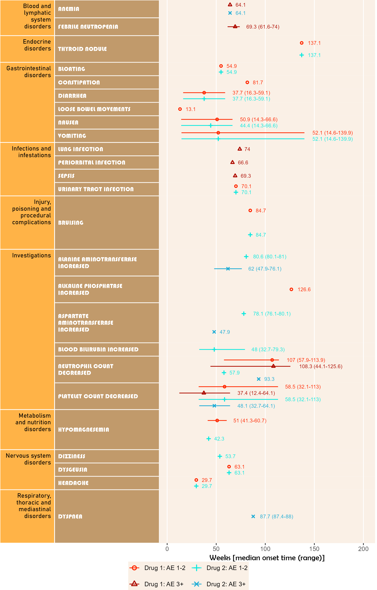

<!-- This file is used to create README.md
Note that the README.md document may need updating to change
'\<0.001' to '<0.001'. 
-->

# BiostatsUHNplus

The goal of **BiostatsUHNplus** is to house publicly available code
functions and snippets (some with multiple package dependencies) used by
[Biostatistics@UHN](https://www.biostatspm.com/) in Toronto, Canada.

Many of these functions build upon the features of
[**reportRmd**](https://github.com/biostatsPMH/reportRmd).

## Installation

If using the main branch of **reportRmd**, you can install the main
version of **BiostatsUHNplus** from [GitHub](https://github.com/) with:

``` r
# install.packages("devtools")
devtools::install_github("biostatsPMH/BiostatsUHNplus", ref="main")
```

If using the development branch of **reportRmd**, you can install the
development version (option to include effect size in nested summaries)
of **BiostatsUHNplus** from [GitHub](https://github.com/) with:

``` r
# install.packages("devtools")
devtools::install_github("biostatsPMH/BiostatsUHNplus", ref="development")
```

## Documentation

[Online Documentation](https://biostatsPMH.github.io/BiostatsUHNplus/)

## Example

### A wrapper for the as.numeric function. Prints entries that fail to parse instead of throwing uninformative error

``` r
library(BiostatsUHNplus);
z <- as_numeric_parse(c(1:5, "String1",6:10,"String2"))
#> The following entries were converted to NA values:
#> Entry 6, 'String1'
#> Entry 12, 'String2'
z
#>  [1]  1  2  3  4  5 NA  6  7  8  9 10 NA
```

### Summary statistics by patient ID nested in cohort, stratified by overall survival status

Use summary output and unnested or nested p-value with caution!

``` r
library(reportRmd);
library(BiostatsUHNplus);
data("pembrolizumab");
#str(pembrolizumab);

rm_covsum_nested(data = pembrolizumab, id = c("id", "cohort"), 
  covs = c("age", "sex", "l_size", "pdl1", "tmb", 
  "baseline_ctdna", "change_ctdna_group", "orr", "cbr", "os_time",
  "pfs_status", "pfs_time"), maincov = "os_status");
```

<table class="table table" style="margin-left: auto; margin-right: auto; margin-left: auto; margin-right: auto;">
<thead>
<tr>
<th style="text-align:left;">
</th>
<th style="text-align:right;">
Full Sample (n=94)
</th>
<th style="text-align:right;">
0 (n=30)
</th>
<th style="text-align:right;">
1 (n=64)
</th>
<th style="text-align:right;">
Unnested p-value
</th>
<th style="text-align:right;">
Unnested Effect Size
</th>
<th style="text-align:right;">
Unnested StatTest
</th>
<th style="text-align:right;">
Nested p-value
</th>
</tr>
</thead>
<tbody>
<tr>
<td style="text-align:left;">
<span style="font-weight: bold;">age</span>
</td>
<td style="text-align:right;">
</td>
<td style="text-align:right;">
</td>
<td style="text-align:right;">
</td>
<td style="text-align:right;">
0.28
</td>
<td style="text-align:right;">
0.11
</td>
<td style="text-align:right;">
Wilcoxon Rank Sum, Wilcoxon r
</td>
<td style="text-align:right;">
0.18
</td>
</tr>
<tr>
<td style="text-align:left;padding-left: 2em;" indentlevel="1">
Mean (sd)
</td>
<td style="text-align:right;">
57.9 (12.8)
</td>
<td style="text-align:right;">
60.4 (11.8)
</td>
<td style="text-align:right;">
56.7 (13.1)
</td>
<td style="text-align:right;">
</td>
<td style="text-align:right;">
</td>
<td style="text-align:right;">
</td>
<td style="text-align:right;">
</td>
</tr>
<tr>
<td style="text-align:left;padding-left: 2em;" indentlevel="1">
Median (Min,Max)
</td>
<td style="text-align:right;">
59.1 (21.1, 81.8)
</td>
<td style="text-align:right;">
62.8 (34.1, 81.8)
</td>
<td style="text-align:right;">
57.9 (21.1, 78.2)
</td>
<td style="text-align:right;">
</td>
<td style="text-align:right;">
</td>
<td style="text-align:right;">
</td>
<td style="text-align:right;">
</td>
</tr>
<tr>
<td style="text-align:left;">
<span style="font-weight: bold;">sex</span>
</td>
<td style="text-align:right;">
</td>
<td style="text-align:right;">
</td>
<td style="text-align:right;">
</td>
<td style="text-align:right;">
1.00
</td>
<td style="text-align:right;">
<0.001
</td>
<td style="text-align:right;">
Chi Sq, Cramer’s V
</td>
<td style="text-align:right;">
0.82
</td>
</tr>
<tr>
<td style="text-align:left;padding-left: 2em;" indentlevel="1">
Female
</td>
<td style="text-align:right;">
58 (62)
</td>
<td style="text-align:right;">
19 (63)
</td>
<td style="text-align:right;">
39 (61)
</td>
<td style="text-align:right;">
</td>
<td style="text-align:right;">
</td>
<td style="text-align:right;">
</td>
<td style="text-align:right;">
</td>
</tr>
<tr>
<td style="text-align:left;padding-left: 2em;" indentlevel="1">
Male
</td>
<td style="text-align:right;">
36 (38)
</td>
<td style="text-align:right;">
11 (37)
</td>
<td style="text-align:right;">
25 (39)
</td>
<td style="text-align:right;">
</td>
<td style="text-align:right;">
</td>
<td style="text-align:right;">
</td>
<td style="text-align:right;">
</td>
</tr>
<tr>
<td style="text-align:left;">
<span style="font-weight: bold;">l size</span>
</td>
<td style="text-align:right;">
</td>
<td style="text-align:right;">
</td>
<td style="text-align:right;">
</td>
<td style="text-align:right;">
0.34
</td>
<td style="text-align:right;">
0.097
</td>
<td style="text-align:right;">
Wilcoxon Rank Sum, Wilcoxon r
</td>
<td style="text-align:right;">
0.35
</td>
</tr>
<tr>
<td style="text-align:left;padding-left: 2em;" indentlevel="1">
Mean (sd)
</td>
<td style="text-align:right;">
87.9 (59.6)
</td>
<td style="text-align:right;">
79.9 (49.9)
</td>
<td style="text-align:right;">
91.7 (63.6)
</td>
<td style="text-align:right;">
</td>
<td style="text-align:right;">
</td>
<td style="text-align:right;">
</td>
<td style="text-align:right;">
</td>
</tr>
<tr>
<td style="text-align:left;padding-left: 2em;" indentlevel="1">
Median (Min,Max)
</td>
<td style="text-align:right;">
73.5 (11.0, 387.0)
</td>
<td style="text-align:right;">
65.5 (11.0, 241.0)
</td>
<td style="text-align:right;">
77 (12, 387)
</td>
<td style="text-align:right;">
</td>
<td style="text-align:right;">
</td>
<td style="text-align:right;">
</td>
<td style="text-align:right;">
</td>
</tr>
<tr>
<td style="text-align:left;">
<span style="font-weight: bold;">pdl1</span>
</td>
<td style="text-align:right;">
</td>
<td style="text-align:right;">
</td>
<td style="text-align:right;">
</td>
<td style="text-align:right;">
0.052
</td>
<td style="text-align:right;">
0.20
</td>
<td style="text-align:right;">
Wilcoxon Rank Sum, Wilcoxon r
</td>
<td style="text-align:right;">
<span style="font-weight: bold;">0.010</span>
</td>
</tr>
<tr>
<td style="text-align:left;padding-left: 2em;" indentlevel="1">
Mean (sd)
</td>
<td style="text-align:right;">
13.9 (29.2)
</td>
<td style="text-align:right;">
25.6 (39.3)
</td>
<td style="text-align:right;">
8.3 (21.2)
</td>
<td style="text-align:right;">
</td>
<td style="text-align:right;">
</td>
<td style="text-align:right;">
</td>
<td style="text-align:right;">
</td>
</tr>
<tr>
<td style="text-align:left;padding-left: 2em;" indentlevel="1">
Median (Min,Max)
</td>
<td style="text-align:right;">
0 (0, 100)
</td>
<td style="text-align:right;">
1 (0, 100)
</td>
<td style="text-align:right;">
0 (0, 95)
</td>
<td style="text-align:right;">
</td>
<td style="text-align:right;">
</td>
<td style="text-align:right;">
</td>
<td style="text-align:right;">
</td>
</tr>
<tr>
<td style="text-align:left;padding-left: 2em;" indentlevel="1">
Missing
</td>
<td style="text-align:right;">
1
</td>
<td style="text-align:right;">
0
</td>
<td style="text-align:right;">
1
</td>
<td style="text-align:right;">
</td>
<td style="text-align:right;">
</td>
<td style="text-align:right;">
</td>
<td style="text-align:right;">
</td>
</tr>
<tr>
<td style="text-align:left;">
<span style="font-weight: bold;">tmb</span>
</td>
<td style="text-align:right;">
</td>
<td style="text-align:right;">
</td>
<td style="text-align:right;">
</td>
<td style="text-align:right;">
0.64
</td>
<td style="text-align:right;">
0.048
</td>
<td style="text-align:right;">
Wilcoxon Rank Sum, Wilcoxon r
</td>
<td style="text-align:right;">
0.12
</td>
</tr>
<tr>
<td style="text-align:left;padding-left: 2em;" indentlevel="1">
Mean (sd)
</td>
<td style="text-align:right;">
0.9 (1.0)
</td>
<td style="text-align:right;">
1.1 (1.3)
</td>
<td style="text-align:right;">
0.8 (0.7)
</td>
<td style="text-align:right;">
</td>
<td style="text-align:right;">
</td>
<td style="text-align:right;">
</td>
<td style="text-align:right;">
</td>
</tr>
<tr>
<td style="text-align:left;padding-left: 2em;" indentlevel="1">
Median (Min,Max)
</td>
<td style="text-align:right;">
0.7 (-0.8, 5.2)
</td>
<td style="text-align:right;">
0.6 (-0.8, 5.2)
</td>
<td style="text-align:right;">
0.7 (-0.6, 3.2)
</td>
<td style="text-align:right;">
</td>
<td style="text-align:right;">
</td>
<td style="text-align:right;">
</td>
<td style="text-align:right;">
</td>
</tr>
<tr>
<td style="text-align:left;">
<span style="font-weight: bold;">baseline ctdna</span>
</td>
<td style="text-align:right;">
</td>
<td style="text-align:right;">
</td>
<td style="text-align:right;">
</td>
<td style="text-align:right;">
<span style="font-weight: bold;"><0.001</span>
</td>
<td style="text-align:right;">
0.37
</td>
<td style="text-align:right;">
Wilcoxon Rank Sum, Wilcoxon r
</td>
<td style="text-align:right;">
<span style="font-weight: bold;">0.017</span>
</td>
</tr>
<tr>
<td style="text-align:left;padding-left: 2em;" indentlevel="1">
Mean (sd)
</td>
<td style="text-align:right;">
358.7 (674.0)
</td>
<td style="text-align:right;">
162.4 (347.7)
</td>
<td style="text-align:right;">
450.7 (766.8)
</td>
<td style="text-align:right;">
</td>
<td style="text-align:right;">
</td>
<td style="text-align:right;">
</td>
<td style="text-align:right;">
</td>
</tr>
<tr>
<td style="text-align:left;padding-left: 2em;" indentlevel="1">
Median (Min,Max)
</td>
<td style="text-align:right;">
86 (0, 4475)
</td>
<td style="text-align:right;">
11.0 (0.0, 1303.7)
</td>
<td style="text-align:right;">
165.6 (0.1, 4475.0)
</td>
<td style="text-align:right;">
</td>
<td style="text-align:right;">
</td>
<td style="text-align:right;">
</td>
<td style="text-align:right;">
</td>
</tr>
<tr>
<td style="text-align:left;">
<span style="font-weight: bold;">change ctdna group</span>
</td>
<td style="text-align:right;">
</td>
<td style="text-align:right;">
</td>
<td style="text-align:right;">
</td>
<td style="text-align:right;">
<span style="font-weight: bold;">0.002</span>
</td>
<td style="text-align:right;">
0.32
</td>
<td style="text-align:right;">
Chi Sq, Cramer’s V
</td>
<td style="text-align:right;">
<span style="font-weight: bold;"><0.001</span>
</td>
</tr>
<tr>
<td style="text-align:left;padding-left: 2em;" indentlevel="1">
Decrease from baseline
</td>
<td style="text-align:right;">
33 (45)
</td>
<td style="text-align:right;">
19 (70)
</td>
<td style="text-align:right;">
14 (30)
</td>
<td style="text-align:right;">
</td>
<td style="text-align:right;">
</td>
<td style="text-align:right;">
</td>
<td style="text-align:right;">
</td>
</tr>
<tr>
<td style="text-align:left;padding-left: 2em;" indentlevel="1">
Increase from baseline
</td>
<td style="text-align:right;">
40 (55)
</td>
<td style="text-align:right;">
8 (30)
</td>
<td style="text-align:right;">
32 (70)
</td>
<td style="text-align:right;">
</td>
<td style="text-align:right;">
</td>
<td style="text-align:right;">
</td>
<td style="text-align:right;">
</td>
</tr>
<tr>
<td style="text-align:left;padding-left: 2em;" indentlevel="1">
Missing
</td>
<td style="text-align:right;">
21
</td>
<td style="text-align:right;">
3
</td>
<td style="text-align:right;">
18
</td>
<td style="text-align:right;">
</td>
<td style="text-align:right;">
</td>
<td style="text-align:right;">
</td>
<td style="text-align:right;">
</td>
</tr>
<tr>
<td style="text-align:left;">
<span style="font-weight: bold;">orr</span>
</td>
<td style="text-align:right;">
</td>
<td style="text-align:right;">
</td>
<td style="text-align:right;">
</td>
<td style="text-align:right;">
<span style="font-weight: bold;"><0.001</span>
</td>
<td style="text-align:right;">
0.51
</td>
<td style="text-align:right;">
Chi Sq, Cramer’s V
</td>
<td style="text-align:right;">
<span style="font-weight: bold;"><0.001</span>
</td>
</tr>
<tr>
<td style="text-align:left;padding-left: 2em;" indentlevel="1">
CR/PR
</td>
<td style="text-align:right;">
16 (17)
</td>
<td style="text-align:right;">
14 (47)
</td>
<td style="text-align:right;">
2 (3)
</td>
<td style="text-align:right;">
</td>
<td style="text-align:right;">
</td>
<td style="text-align:right;">
</td>
<td style="text-align:right;">
</td>
</tr>
<tr>
<td style="text-align:left;padding-left: 2em;" indentlevel="1">
SD/PD
</td>
<td style="text-align:right;">
78 (83)
</td>
<td style="text-align:right;">
16 (53)
</td>
<td style="text-align:right;">
62 (97)
</td>
<td style="text-align:right;">
</td>
<td style="text-align:right;">
</td>
<td style="text-align:right;">
</td>
<td style="text-align:right;">
</td>
</tr>
<tr>
<td style="text-align:left;">
<span style="font-weight: bold;">cbr</span>
</td>
<td style="text-align:right;">
</td>
<td style="text-align:right;">
</td>
<td style="text-align:right;">
</td>
<td style="text-align:right;">
<span style="font-weight: bold;"><0.001</span>
</td>
<td style="text-align:right;">
0.46
</td>
<td style="text-align:right;">
Chi Sq, Cramer’s V
</td>
<td style="text-align:right;">
<span style="font-weight: bold;"><0.001</span>
</td>
</tr>
<tr>
<td style="text-align:left;padding-left: 2em;" indentlevel="1">
CR/PR/SD\>=C6
</td>
<td style="text-align:right;">
24 (26)
</td>
<td style="text-align:right;">
17 (57)
</td>
<td style="text-align:right;">
7 (11)
</td>
<td style="text-align:right;">
</td>
<td style="text-align:right;">
</td>
<td style="text-align:right;">
</td>
<td style="text-align:right;">
</td>
</tr>
<tr>
<td style="text-align:left;padding-left: 2em;" indentlevel="1">
PD/SD<c6>
<td style="text-align:right;">
70 (74)
</td>
<td style="text-align:right;">
13 (43)
</td>
<td style="text-align:right;">
57 (89)
</td>
<td style="text-align:right;">
</td>
<td style="text-align:right;">
</td>
<td style="text-align:right;">
</td>
<td style="text-align:right;">
</td>
</c6>
</td>
</tr>
<tr>
<td style="text-align:left;">
<span style="font-weight: bold;">os time</span>
</td>
<td style="text-align:right;">
</td>
<td style="text-align:right;">
</td>
<td style="text-align:right;">
</td>
<td style="text-align:right;">
<span style="font-weight: bold;"><0.001</span>
</td>
<td style="text-align:right;">
0.70
</td>
<td style="text-align:right;">
Wilcoxon Rank Sum, Wilcoxon r
</td>
<td style="text-align:right;">
<span style="font-weight: bold;"><0.001</span>
</td>
</tr>
<tr>
<td style="text-align:left;padding-left: 2em;" indentlevel="1">
Mean (sd)
</td>
<td style="text-align:right;">
14.7 (10.2)
</td>
<td style="text-align:right;">
25.7 (6.8)
</td>
<td style="text-align:right;">
9.6 (7.1)
</td>
<td style="text-align:right;">
</td>
<td style="text-align:right;">
</td>
<td style="text-align:right;">
</td>
<td style="text-align:right;">
</td>
</tr>
<tr>
<td style="text-align:left;padding-left: 2em;" indentlevel="1">
Median (Min,Max)
</td>
<td style="text-align:right;">
13.8 (0.6, 35.4)
</td>
<td style="text-align:right;">
26.7 (9.5, 35.4)
</td>
<td style="text-align:right;">
7.8 (0.6, 27.5)
</td>
<td style="text-align:right;">
</td>
<td style="text-align:right;">
</td>
<td style="text-align:right;">
</td>
<td style="text-align:right;">
</td>
</tr>
<tr>
<td style="text-align:left;">
<span style="font-weight: bold;">pfs status</span>
</td>
<td style="text-align:right;">
</td>
<td style="text-align:right;">
</td>
<td style="text-align:right;">
</td>
<td style="text-align:right;">
<span style="font-weight: bold;"><0.001</span>
</td>
<td style="text-align:right;">
0.56
</td>
<td style="text-align:right;">
Wilcoxon Rank Sum, Wilcoxon r
</td>
<td style="text-align:right;">
Did not converge;<br>quasi or complete<br>category separation
</td>
</tr>
<tr>
<td style="text-align:left;padding-left: 2em;" indentlevel="1">
Mean (sd)
</td>
<td style="text-align:right;">
0.9 (0.3)
</td>
<td style="text-align:right;">
0.6 (0.5)
</td>
<td style="text-align:right;">
1.0 (0.0)
</td>
<td style="text-align:right;">
</td>
<td style="text-align:right;">
</td>
<td style="text-align:right;">
</td>
<td style="text-align:right;">
</td>
</tr>
<tr>
<td style="text-align:left;padding-left: 2em;" indentlevel="1">
Median (Min,Max)
</td>
<td style="text-align:right;">
1 (0, 1)
</td>
<td style="text-align:right;">
1 (0, 1)
</td>
<td style="text-align:right;">
1 (1, 1)
</td>
<td style="text-align:right;">
</td>
<td style="text-align:right;">
</td>
<td style="text-align:right;">
</td>
<td style="text-align:right;">
</td>
</tr>
<tr>
<td style="text-align:left;">
<span style="font-weight: bold;">pfs time</span>
</td>
<td style="text-align:right;">
</td>
<td style="text-align:right;">
</td>
<td style="text-align:right;">
</td>
<td style="text-align:right;">
<span style="font-weight: bold;"><0.001</span>
</td>
<td style="text-align:right;">
0.50
</td>
<td style="text-align:right;">
Wilcoxon Rank Sum, Wilcoxon r
</td>
<td style="text-align:right;">
<span style="font-weight: bold;"><0.001</span>
</td>
</tr>
<tr>
<td style="text-align:left;padding-left: 2em;" indentlevel="1">
Mean (sd)
</td>
<td style="text-align:right;">
6.2 (8.7)
</td>
<td style="text-align:right;">
14.3 (11.7)
</td>
<td style="text-align:right;">
2.5 (2.0)
</td>
<td style="text-align:right;">
</td>
<td style="text-align:right;">
</td>
<td style="text-align:right;">
</td>
<td style="text-align:right;">
</td>
</tr>
<tr>
<td style="text-align:left;padding-left: 2em;" indentlevel="1">
Median (Min,Max)
</td>
<td style="text-align:right;">
1.9 (0.4, 35.4)
</td>
<td style="text-align:right;">
14.9 (0.8, 35.4)
</td>
<td style="text-align:right;">
1.9 (0.4, 10.1)
</td>
<td style="text-align:right;">
</td>
<td style="text-align:right;">
</td>
<td style="text-align:right;">
</td>
<td style="text-align:right;">
</td>
</tr>
</tbody>
</table>

### Outputs three DSMB-CCRU AE summary tables in Excel format per UHN template

Uses addendum fake study data. DSMB-CCRU AE summary tables in below code
example can be found in the *dsmb_ccru_tables* folder of
**BiostatsUHNplus** package.

``` r
library(reportRmd);
library(BiostatsUHNplus);
data("enrollment", "demography", "ineligibility", "ae");

## This does summary for all participants;
dsmb_ccru(protocol="EXAMPLE_STUDY",setwd=".",
          title="Phase X Study to Evaluate Treatments A-D",
          comp=NULL,pi="Dr. Principal Investigator",
          presDate="30OCT2020",cutDate="31AUG2020",
          boundDate=NULL,subjID="Subject",subjID_ineligText=c("New Subject","Test"),
          baseline_datasets=list(enrollment,demography,ineligibility),
          ae_dataset=ae,ineligVar="INELIGIBILITY_STATUS",ineligVarText=c("Yes","Y"),
          genderVar="GENDER_CODE",enrolDtVar="ENROL_DATE_INT",ae_detailVar="ae_detail",
          ae_categoryVar="ae_category",ae_severityVar="AE_SEV_GD",
          ae_onsetDtVar="AE_ONSET_DT_INT",ae_detailOtherText="Other, specify",
          ae_detailOtherVar="CTCAE5_LLT_NM",ae_verbatimVar="AE_VERBATIM_TRM_TXT",
          numSubj=NULL)

## This does summary for each cohort;
dsmb_ccru(protocol="EXAMPLE_STUDY",setwd=".",
          title="Phase X Study to Evaluate Treatments A-D",
          comp="COHORT",pi="Dr. Principal Investigator",
          presDate="30OCT2020",cutDate="31AUG2020",
          boundDate=NULL,subjID="Subject",subjID_ineligText=c("New Subject","Test"),
          baseline_datasets=list(enrollment,demography,ineligibility),
          ae_dataset=ae,ineligVar="INELIGIBILITY_STATUS",ineligVarText=c("Yes","Y"),
          genderVar="GENDER_CODE",enrolDtVar="ENROL_DATE_INT",ae_detailVar="ae_detail",
          ae_categoryVar="ae_category",ae_severityVar="AE_SEV_GD",
          ae_onsetDtVar="AE_ONSET_DT_INT",ae_detailOtherText="Other, specify",
          ae_detailOtherVar="CTCAE5_LLT_NM",ae_verbatimVar="AE_VERBATIM_TRM_TXT",
          numSubj=NULL)
```

### Adverse event timeline plots

Uses addendum fake study data. Shows timeline for onset of AE after
study enrollment. Can display up to 5 attributions. Time unit may be one
of day, week, month or year.

The below plot includes both AE category and AE detail in default colour
and font scheme.

``` r
library(ggplot2);
library(BiostatsUHNplus);
data("enrollment", "ae");

p <- ae_timeline_plot(subjID="Subject",subjID_ineligText=c("New Subject","Test"),
                 baseline_datasets=list(enrollment),
                 ae_dataset=ae,
                 ae_attribVars=c("CTC_AE_ATTR_SCALE","CTC_AE_ATTR_SCALE_1"),
                 ae_attribVarsName=c("Drug 1","Drug 2"),
                 ae_attribVarText=c("Definite", "Probable", "Possible"),
                 startDtVar="ENROL_DATE_INT",ae_detailVar="ae_detail",
                 ae_categoryVar="ae_category",ae_severityVar="AE_SEV_GD",
                 ae_onsetDtVar="AE_ONSET_DT_INT",time_unit="week")
ggsave(paste("man/figures/ae_detail_timeline_plot", ".png", sep=""), p, width=6.4, height=10, device="png", scale = 1.15);
```



The next plot summarizes timeline by AE category. Fonts, colours,
symbols, column widths (character length) and time unit are customized.

The *width*, *height* and *scale* parameters in ggsave() can also be
modified to fit a large plot.

``` r
library(ggplot2);
library(BiostatsUHNplus);
data("enrollment", "ae");

p <- ae_timeline_plot(subjID="Subject",subjID_ineligText=c("New Subject","Test"),
                 baseline_datasets=list(enrollment),
                 ae_dataset=ae,
                 ae_attribVars=c("CTC_AE_ATTR_SCALE","CTC_AE_ATTR_SCALE_1"),
                 ae_attribVarsName=c("Drug 1","Drug 2"),
                 ae_attribVarText=c("Definite", "Probable", "Possible"),
                 startDtVar="ENROL_DATE_INT",ae_detailVar="ae_detail",
                 ae_categoryVar="ae_category",ae_severityVar="AE_SEV_GD",
                 ae_onsetDtVar="AE_ONSET_DT_INT",time_unit="month",
                 include_ae_detail=F,
                 fonts=c("Forte","Gadugi","French Script MT","Albany AMT","Calibri"),
                 fontColours=c("#FF4F00","#FFDB58"),
                 panelColours=c("#AAF0D1","#B31B1B"),
                 attribColours=c("#F6ADC6","#C54B8C","#A4DDED","#0077BE","#9AB973",
                                 "#01796F","#FFA343","#CC7722","#E0B0FF","#5A4FCF"),
                 attribSymbols=c(5,6,7,8,15,16,17,18,19,20),
                 columnWidths=c(23,15))
ggsave(paste("man/figures/ae_category_timeline_plot", ".png", sep=""), p, width=3.6, height=5.4, device="png", scale = 1);
```


