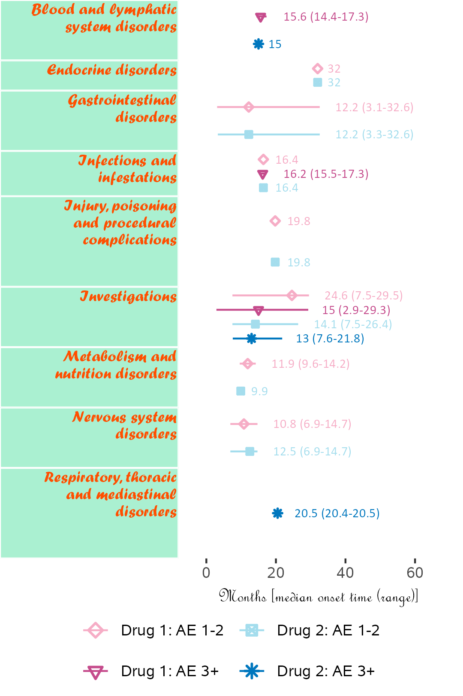
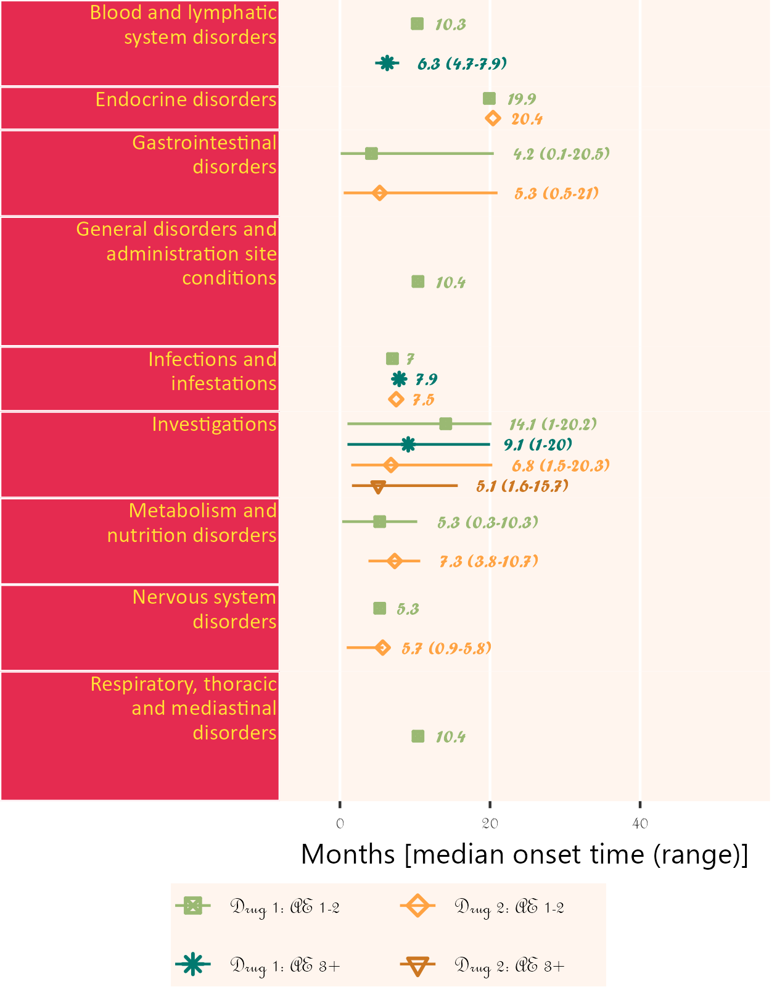

<!-- This file is used to create README.md
Note that the README.md document may need updating to change
'\<0.001' to '<0.001'. 
-->

# BiostatsUHNplus

The goal of **BiostatsUHNplus** is to house publicly available code
functions and snippets (some with multiple package dependencies) used by
[Biostatistics@UHN](https://www.biostatsuhn.com/) in Toronto, Canada.

Many of these functions build upon the features of
[**reportRmd**](https://github.com/biostatsPMH/reportRmd).

## Installation

If using the main branch of **reportRmd**, you can install the main
version of **BiostatsUHNplus** from [GitHub](https://github.com/) with:

``` r
# install.packages("devtools")
devtools::install_github("biostatsPMH/BiostatsUHNplus", ref="main")
```

If using the development branch of **reportRmd**, you can install the
development version (option to include effect size in nested summaries)
of **BiostatsUHNplus** from [GitHub](https://github.com/) with:

``` r
# install.packages("devtools")
devtools::install_github("biostatsPMH/BiostatsUHNplus", ref="development")
```

## Documentation

[Online Documentation](https://biostatsPMH.github.io/BiostatsUHNplus/)

## Examples

### A wrapper for the as.numeric function. Prints entries that fail to parse instead of throwing uninformative error

``` r
library(BiostatsUHNplus);
z <- as_numeric_parse(c(1:5, "String1",6:10,"String2"))
#> The following entries were converted to NA values:
#> Entry 6, 'String1'
#> Entry 12, 'String2'
z
#>  [1]  1  2  3  4  5 NA  6  7  8  9 10 NA
```

### Summary statistics of adverse events nested by participant in cohort, stratified by adverse event severity

Uses addendum fake study data. Interpret summary output and unnested or
nested p-value with caution!

Note that if participants were enrolled in more than cohort (crossover),
the total N for Full Sample would be less than that of the total N of
the adverse event severity categories. Since total N for Full Sample
(287) is the same as total N of the severity categories (131 + 88 + 56 +
10 + 2), this suggests that there was no crossover of participants in
cohorts.

``` r
library(plyr);
library(BiostatsUHNplus);

data("enrollment", "demography", "ineligibility", "ae");
clinT <- plyr::join_all(list(enrollment, demography, ineligibility, ae), 
  by = "Subject", type = "full");

rm_covsum_nested(data = clinT, id = c("ae_detail", "Subject", "COHORT"), 
  covs = c("ENROL_DATE_INT", "COHORT", "GENDER_CODE", "INELIGIBILITY_STATUS", "AE_ONSET_DT_INT",
  "CTC_AE_ATTR_SCALE", "CTC_AE_ATTR_SCALE_1", "ae_category"), maincov = "AE_SEV_GD");
```

<table class="table table" style="margin-left: auto; margin-right: auto; margin-left: auto; margin-right: auto;">
<thead>
<tr>
<th style="text-align:left;">
</th>
<th style="text-align:right;">
Full Sample (n=287)
</th>
<th style="text-align:right;">
1 (n=131)
</th>
<th style="text-align:right;">
2 (n=88)
</th>
<th style="text-align:right;">
3 (n=56)
</th>
<th style="text-align:right;">
4 (n=10)
</th>
<th style="text-align:right;">
5 (n=2)
</th>
<th style="text-align:right;">
Unnested p-value
</th>
<th style="text-align:right;">
Unnested Effect Size
</th>
<th style="text-align:right;">
Unnested StatTest
</th>
<th style="text-align:right;">
Nested p-value
</th>
</tr>
</thead>
<tbody>
<tr>
<td style="text-align:left;">
<span style="font-weight: bold;">ENROL DATE INT</span>
</td>
<td style="text-align:right;">
</td>
<td style="text-align:right;">
</td>
<td style="text-align:right;">
</td>
<td style="text-align:right;">
</td>
<td style="text-align:right;">
</td>
<td style="text-align:right;">
</td>
<td style="text-align:right;">
0.83
</td>
<td style="text-align:right;">
0.004
</td>
<td style="text-align:right;">
Kruskal Wallis, Eta sq
</td>
<td style="text-align:right;">
0.54
</td>
</tr>
<tr>
<td style="text-align:left;padding-left: 2em;" indentlevel="1">
Mean (sd)
</td>
<td style="text-align:right;">
2016-12-20 (296.7 days)
</td>
<td style="text-align:right;">
2016-12-09 (278.8 days)
</td>
<td style="text-align:right;">
2016-12-24 (285.6 days)
</td>
<td style="text-align:right;">
2017-01-16 (346.4 days)
</td>
<td style="text-align:right;">
2016-12-07 (365.5 days)
</td>
<td style="text-align:right;">
2016-07-29 (272.9 days)
</td>
<td style="text-align:right;">
</td>
<td style="text-align:right;">
</td>
<td style="text-align:right;">
</td>
<td style="text-align:right;">
</td>
</tr>
<tr>
<td style="text-align:left;padding-left: 2em;" indentlevel="1">
Median (Min,Max)
</td>
<td style="text-align:right;">
2016-09-14 (2016-01-18, 2018-05-16)
</td>
<td style="text-align:right;">
2016-09-14 (2016-01-18, 2018-05-16)
</td>
<td style="text-align:right;">
2016-09-14 (2016-01-18, 2018-05-16)
</td>
<td style="text-align:right;">
2016-09-14 (2016-01-18, 2018-04-25)
</td>
<td style="text-align:right;">
2016-08-02 (2016-01-18, 2018-04-25)
</td>
<td style="text-align:right;">
2016-07-29 (2016-01-18, 2017-02-07)
</td>
<td style="text-align:right;">
</td>
<td style="text-align:right;">
</td>
<td style="text-align:right;">
</td>
<td style="text-align:right;">
</td>
</tr>
<tr>
<td style="text-align:left;">
<span style="font-weight: bold;">COHORT</span>
</td>
<td style="text-align:right;">
</td>
<td style="text-align:right;">
</td>
<td style="text-align:right;">
</td>
<td style="text-align:right;">
</td>
<td style="text-align:right;">
</td>
<td style="text-align:right;">
</td>
<td style="text-align:right;">
0.25
</td>
<td style="text-align:right;">
0.13
</td>
<td style="text-align:right;">
Chi Sq, Cramer’s V
</td>
<td style="text-align:right;">
0.25
</td>
</tr>
<tr>
<td style="text-align:left;padding-left: 2em;" indentlevel="1">
Cohort A
</td>
<td style="text-align:right;">
74 (26)
</td>
<td style="text-align:right;">
31 (24)
</td>
<td style="text-align:right;">
20 (23)
</td>
<td style="text-align:right;">
18 (32)
</td>
<td style="text-align:right;">
4 (40)
</td>
<td style="text-align:right;">
1 (50)
</td>
<td style="text-align:right;">
</td>
<td style="text-align:right;">
</td>
<td style="text-align:right;">
</td>
<td style="text-align:right;">
</td>
</tr>
<tr>
<td style="text-align:left;padding-left: 2em;" indentlevel="1">
Cohort B
</td>
<td style="text-align:right;">
110 (38)
</td>
<td style="text-align:right;">
57 (44)
</td>
<td style="text-align:right;">
33 (38)
</td>
<td style="text-align:right;">
16 (29)
</td>
<td style="text-align:right;">
3 (30)
</td>
<td style="text-align:right;">
1 (50)
</td>
<td style="text-align:right;">
</td>
<td style="text-align:right;">
</td>
<td style="text-align:right;">
</td>
<td style="text-align:right;">
</td>
</tr>
<tr>
<td style="text-align:left;padding-left: 2em;" indentlevel="1">
Cohort C
</td>
<td style="text-align:right;">
40 (14)
</td>
<td style="text-align:right;">
19 (15)
</td>
<td style="text-align:right;">
17 (19)
</td>
<td style="text-align:right;">
4 (7)
</td>
<td style="text-align:right;">
0 (0)
</td>
<td style="text-align:right;">
0 (0)
</td>
<td style="text-align:right;">
</td>
<td style="text-align:right;">
</td>
<td style="text-align:right;">
</td>
<td style="text-align:right;">
</td>
</tr>
<tr>
<td style="text-align:left;padding-left: 2em;" indentlevel="1">
Cohort D
</td>
<td style="text-align:right;">
63 (22)
</td>
<td style="text-align:right;">
24 (18)
</td>
<td style="text-align:right;">
18 (20)
</td>
<td style="text-align:right;">
18 (32)
</td>
<td style="text-align:right;">
3 (30)
</td>
<td style="text-align:right;">
0 (0)
</td>
<td style="text-align:right;">
</td>
<td style="text-align:right;">
</td>
<td style="text-align:right;">
</td>
<td style="text-align:right;">
</td>
</tr>
<tr>
<td style="text-align:left;">
<span style="font-weight: bold;">GENDER CODE</span>
</td>
<td style="text-align:right;">
</td>
<td style="text-align:right;">
</td>
<td style="text-align:right;">
</td>
<td style="text-align:right;">
</td>
<td style="text-align:right;">
</td>
<td style="text-align:right;">
</td>
<td style="text-align:right;">
0.26
</td>
<td style="text-align:right;">
0.14
</td>
<td style="text-align:right;">
Chi Sq, Cramer’s V
</td>
<td style="text-align:right;">
0.45
</td>
</tr>
<tr>
<td style="text-align:left;padding-left: 2em;" indentlevel="1">
Female
</td>
<td style="text-align:right;">
66 (23)
</td>
<td style="text-align:right;">
27 (21)
</td>
<td style="text-align:right;">
17 (19)
</td>
<td style="text-align:right;">
17 (30)
</td>
<td style="text-align:right;">
4 (40)
</td>
<td style="text-align:right;">
1 (50)
</td>
<td style="text-align:right;">
</td>
<td style="text-align:right;">
</td>
<td style="text-align:right;">
</td>
<td style="text-align:right;">
</td>
</tr>
<tr>
<td style="text-align:left;padding-left: 2em;" indentlevel="1">
Male
</td>
<td style="text-align:right;">
221 (77)
</td>
<td style="text-align:right;">
104 (79)
</td>
<td style="text-align:right;">
71 (81)
</td>
<td style="text-align:right;">
39 (70)
</td>
<td style="text-align:right;">
6 (60)
</td>
<td style="text-align:right;">
1 (50)
</td>
<td style="text-align:right;">
</td>
<td style="text-align:right;">
</td>
<td style="text-align:right;">
</td>
<td style="text-align:right;">
</td>
</tr>
<tr>
<td style="text-align:left;">
<span style="font-weight: bold;">INELIGIBILITY STATUS</span>
</td>
<td style="text-align:right;">
</td>
<td style="text-align:right;">
</td>
<td style="text-align:right;">
</td>
<td style="text-align:right;">
</td>
<td style="text-align:right;">
</td>
<td style="text-align:right;">
</td>
<td style="text-align:right;">
</td>
<td style="text-align:right;">
</td>
<td style="text-align:right;">
Chi Sq, Cramer’s V
</td>
<td style="text-align:right;">
</td>
</tr>
<tr>
<td style="text-align:left;padding-left: 2em;" indentlevel="1">
No
</td>
<td style="text-align:right;">
262 (100)
</td>
<td style="text-align:right;">
115 (100)
</td>
<td style="text-align:right;">
82 (100)
</td>
<td style="text-align:right;">
53 (100)
</td>
<td style="text-align:right;">
10 (100)
</td>
<td style="text-align:right;">
2 (100)
</td>
<td style="text-align:right;">
</td>
<td style="text-align:right;">
</td>
<td style="text-align:right;">
</td>
<td style="text-align:right;">
</td>
</tr>
<tr>
<td style="text-align:left;padding-left: 2em;" indentlevel="1">
Missing
</td>
<td style="text-align:right;">
25
</td>
<td style="text-align:right;">
16
</td>
<td style="text-align:right;">
6
</td>
<td style="text-align:right;">
3
</td>
<td style="text-align:right;">
0
</td>
<td style="text-align:right;">
0
</td>
<td style="text-align:right;">
</td>
<td style="text-align:right;">
</td>
<td style="text-align:right;">
</td>
<td style="text-align:right;">
</td>
</tr>
<tr>
<td style="text-align:left;">
<span style="font-weight: bold;">AE ONSET DT INT</span>
</td>
<td style="text-align:right;">
</td>
<td style="text-align:right;">
</td>
<td style="text-align:right;">
</td>
<td style="text-align:right;">
</td>
<td style="text-align:right;">
</td>
<td style="text-align:right;">
</td>
<td style="text-align:right;">
0.66
</td>
<td style="text-align:right;">
0.008
</td>
<td style="text-align:right;">
Kruskal Wallis, Eta sq
</td>
<td style="text-align:right;">
0.56
</td>
</tr>
<tr>
<td style="text-align:left;padding-left: 2em;" indentlevel="1">
Mean (sd)
</td>
<td style="text-align:right;">
2017-11-06 (165.8 days)
</td>
<td style="text-align:right;">
2017-11-11 (166.8 days)
</td>
<td style="text-align:right;">
2017-10-28 (180.4 days)
</td>
<td style="text-align:right;">
2017-11-22 (148.1 days)
</td>
<td style="text-align:right;">
2017-09-12 (118.1 days)
</td>
<td style="text-align:right;">
2017-09-07 (152.7 days)
</td>
<td style="text-align:right;">
</td>
<td style="text-align:right;">
</td>
<td style="text-align:right;">
</td>
<td style="text-align:right;">
</td>
</tr>
<tr>
<td style="text-align:left;padding-left: 2em;" indentlevel="1">
Median (Min,Max)
</td>
<td style="text-align:right;">
2017-10-12 (2016-05-02, 2019-01-13)
</td>
<td style="text-align:right;">
2017-10-11 (2017-03-18, 2019-01-08)
</td>
<td style="text-align:right;">
2017-10-01 (2016-05-02, 2019-01-13)
</td>
<td style="text-align:right;">
2017-11-21 (2017-03-16, 2018-12-19)
</td>
<td style="text-align:right;">
2017-09-10 (2017-04-11, 2018-04-15)
</td>
<td style="text-align:right;">
2017-09-07 (2017-05-22, 2017-12-24)
</td>
<td style="text-align:right;">
</td>
<td style="text-align:right;">
</td>
<td style="text-align:right;">
</td>
<td style="text-align:right;">
</td>
</tr>
<tr>
<td style="text-align:left;">
<span style="font-weight: bold;">CTC AE ATTR SCALE</span>
</td>
<td style="text-align:right;">
</td>
<td style="text-align:right;">
</td>
<td style="text-align:right;">
</td>
<td style="text-align:right;">
</td>
<td style="text-align:right;">
</td>
<td style="text-align:right;">
</td>
<td style="text-align:right;">
<span style="font-weight: bold;"><0.001</span>
</td>
<td style="text-align:right;">
0.22
</td>
<td style="text-align:right;">
Chi Sq, Cramer’s V
</td>
<td style="text-align:right;">
<span style="font-weight: bold;"><0.001</span>
</td>
</tr>
<tr>
<td style="text-align:left;padding-left: 2em;" indentlevel="1">
Possible
</td>
<td style="text-align:right;">
53 (18)
</td>
<td style="text-align:right;">
19 (15)
</td>
<td style="text-align:right;">
16 (18)
</td>
<td style="text-align:right;">
12 (21)
</td>
<td style="text-align:right;">
6 (60)
</td>
<td style="text-align:right;">
0 (0)
</td>
<td style="text-align:right;">
</td>
<td style="text-align:right;">
</td>
<td style="text-align:right;">
</td>
<td style="text-align:right;">
</td>
</tr>
<tr>
<td style="text-align:left;padding-left: 2em;" indentlevel="1">
Probable
</td>
<td style="text-align:right;">
6 (2)
</td>
<td style="text-align:right;">
3 (2)
</td>
<td style="text-align:right;">
1 (1)
</td>
<td style="text-align:right;">
1 (2)
</td>
<td style="text-align:right;">
1 (10)
</td>
<td style="text-align:right;">
0 (0)
</td>
<td style="text-align:right;">
</td>
<td style="text-align:right;">
</td>
<td style="text-align:right;">
</td>
<td style="text-align:right;">
</td>
</tr>
<tr>
<td style="text-align:left;padding-left: 2em;" indentlevel="1">
Unlikely
</td>
<td style="text-align:right;">
139 (48)
</td>
<td style="text-align:right;">
82 (63)
</td>
<td style="text-align:right;">
38 (43)
</td>
<td style="text-align:right;">
19 (34)
</td>
<td style="text-align:right;">
0 (0)
</td>
<td style="text-align:right;">
0 (0)
</td>
<td style="text-align:right;">
</td>
<td style="text-align:right;">
</td>
<td style="text-align:right;">
</td>
<td style="text-align:right;">
</td>
</tr>
<tr>
<td style="text-align:left;padding-left: 2em;" indentlevel="1">
Unrelated
</td>
<td style="text-align:right;">
89 (31)
</td>
<td style="text-align:right;">
27 (21)
</td>
<td style="text-align:right;">
33 (38)
</td>
<td style="text-align:right;">
24 (43)
</td>
<td style="text-align:right;">
3 (30)
</td>
<td style="text-align:right;">
2 (100)
</td>
<td style="text-align:right;">
</td>
<td style="text-align:right;">
</td>
<td style="text-align:right;">
</td>
<td style="text-align:right;">
</td>
</tr>
<tr>
<td style="text-align:left;">
<span style="font-weight: bold;">CTC AE ATTR SCALE 1</span>
</td>
<td style="text-align:right;">
</td>
<td style="text-align:right;">
</td>
<td style="text-align:right;">
</td>
<td style="text-align:right;">
</td>
<td style="text-align:right;">
</td>
<td style="text-align:right;">
</td>
<td style="text-align:right;">
0.72
</td>
<td style="text-align:right;">
0.10
</td>
<td style="text-align:right;">
Chi Sq, Cramer’s V
</td>
<td style="text-align:right;">
0.26
</td>
</tr>
<tr>
<td style="text-align:left;padding-left: 2em;" indentlevel="1">
</td>
<td style="text-align:right;">
2 (1)
</td>
<td style="text-align:right;">
2 (2)
</td>
<td style="text-align:right;">
0 (0)
</td>
<td style="text-align:right;">
0 (0)
</td>
<td style="text-align:right;">
0 (0)
</td>
<td style="text-align:right;">
0 (0)
</td>
<td style="text-align:right;">
</td>
<td style="text-align:right;">
</td>
<td style="text-align:right;">
</td>
<td style="text-align:right;">
</td>
</tr>
<tr>
<td style="text-align:left;padding-left: 2em;" indentlevel="1">
Possible
</td>
<td style="text-align:right;">
50 (17)
</td>
<td style="text-align:right;">
19 (15)
</td>
<td style="text-align:right;">
18 (20)
</td>
<td style="text-align:right;">
10 (18)
</td>
<td style="text-align:right;">
3 (30)
</td>
<td style="text-align:right;">
0 (0)
</td>
<td style="text-align:right;">
</td>
<td style="text-align:right;">
</td>
<td style="text-align:right;">
</td>
<td style="text-align:right;">
</td>
</tr>
<tr>
<td style="text-align:left;padding-left: 2em;" indentlevel="1">
Probable
</td>
<td style="text-align:right;">
4 (1)
</td>
<td style="text-align:right;">
3 (2)
</td>
<td style="text-align:right;">
1 (1)
</td>
<td style="text-align:right;">
0 (0)
</td>
<td style="text-align:right;">
0 (0)
</td>
<td style="text-align:right;">
0 (0)
</td>
<td style="text-align:right;">
</td>
<td style="text-align:right;">
</td>
<td style="text-align:right;">
</td>
<td style="text-align:right;">
</td>
</tr>
<tr>
<td style="text-align:left;padding-left: 2em;" indentlevel="1">
Unlikely
</td>
<td style="text-align:right;">
112 (39)
</td>
<td style="text-align:right;">
58 (44)
</td>
<td style="text-align:right;">
28 (32)
</td>
<td style="text-align:right;">
23 (41)
</td>
<td style="text-align:right;">
3 (30)
</td>
<td style="text-align:right;">
0 (0)
</td>
<td style="text-align:right;">
</td>
<td style="text-align:right;">
</td>
<td style="text-align:right;">
</td>
<td style="text-align:right;">
</td>
</tr>
<tr>
<td style="text-align:left;padding-left: 2em;" indentlevel="1">
Unrelated
</td>
<td style="text-align:right;">
119 (41)
</td>
<td style="text-align:right;">
49 (37)
</td>
<td style="text-align:right;">
41 (47)
</td>
<td style="text-align:right;">
23 (41)
</td>
<td style="text-align:right;">
4 (40)
</td>
<td style="text-align:right;">
2 (100)
</td>
<td style="text-align:right;">
</td>
<td style="text-align:right;">
</td>
<td style="text-align:right;">
</td>
<td style="text-align:right;">
</td>
</tr>
<tr>
<td style="text-align:left;">
<span style="font-weight: bold;">ae category</span>
</td>
<td style="text-align:right;">
</td>
<td style="text-align:right;">
</td>
<td style="text-align:right;">
</td>
<td style="text-align:right;">
</td>
<td style="text-align:right;">
</td>
<td style="text-align:right;">
</td>
<td style="text-align:right;">
<span style="font-weight: bold;"><0.001</span>
</td>
<td style="text-align:right;">
0.36
</td>
<td style="text-align:right;">
Chi Sq, Cramer’s V
</td>
<td style="text-align:right;">
<span style="font-weight: bold;"><0.001</span>
</td>
</tr>
<tr>
<td style="text-align:left;padding-left: 2em;" indentlevel="1">
Blood and lymphatic system disorders
</td>
<td style="text-align:right;">
16 (6)
</td>
<td style="text-align:right;">
0 (0)
</td>
<td style="text-align:right;">
5 (6)
</td>
<td style="text-align:right;">
11 (20)
</td>
<td style="text-align:right;">
0 (0)
</td>
<td style="text-align:right;">
0 (0)
</td>
<td style="text-align:right;">
</td>
<td style="text-align:right;">
</td>
<td style="text-align:right;">
</td>
<td style="text-align:right;">
</td>
</tr>
<tr>
<td style="text-align:left;padding-left: 2em;" indentlevel="1">
Cardiac disorders
</td>
<td style="text-align:right;">
6 (2)
</td>
<td style="text-align:right;">
3 (2)
</td>
<td style="text-align:right;">
3 (3)
</td>
<td style="text-align:right;">
0 (0)
</td>
<td style="text-align:right;">
0 (0)
</td>
<td style="text-align:right;">
0 (0)
</td>
<td style="text-align:right;">
</td>
<td style="text-align:right;">
</td>
<td style="text-align:right;">
</td>
<td style="text-align:right;">
</td>
</tr>
<tr>
<td style="text-align:left;padding-left: 2em;" indentlevel="1">
Ear and labyrinth disorders
</td>
<td style="text-align:right;">
1 (0)
</td>
<td style="text-align:right;">
0 (0)
</td>
<td style="text-align:right;">
1 (1)
</td>
<td style="text-align:right;">
0 (0)
</td>
<td style="text-align:right;">
0 (0)
</td>
<td style="text-align:right;">
0 (0)
</td>
<td style="text-align:right;">
</td>
<td style="text-align:right;">
</td>
<td style="text-align:right;">
</td>
<td style="text-align:right;">
</td>
</tr>
<tr>
<td style="text-align:left;padding-left: 2em;" indentlevel="1">
Endocrine disorders
</td>
<td style="text-align:right;">
1 (0)
</td>
<td style="text-align:right;">
1 (1)
</td>
<td style="text-align:right;">
0 (0)
</td>
<td style="text-align:right;">
0 (0)
</td>
<td style="text-align:right;">
0 (0)
</td>
<td style="text-align:right;">
0 (0)
</td>
<td style="text-align:right;">
</td>
<td style="text-align:right;">
</td>
<td style="text-align:right;">
</td>
<td style="text-align:right;">
</td>
</tr>
<tr>
<td style="text-align:left;padding-left: 2em;" indentlevel="1">
Eye disorders
</td>
<td style="text-align:right;">
5 (2)
</td>
<td style="text-align:right;">
3 (2)
</td>
<td style="text-align:right;">
2 (2)
</td>
<td style="text-align:right;">
0 (0)
</td>
<td style="text-align:right;">
0 (0)
</td>
<td style="text-align:right;">
0 (0)
</td>
<td style="text-align:right;">
</td>
<td style="text-align:right;">
</td>
<td style="text-align:right;">
</td>
<td style="text-align:right;">
</td>
</tr>
<tr>
<td style="text-align:left;padding-left: 2em;" indentlevel="1">
Gastrointestinal disorders
</td>
<td style="text-align:right;">
39 (14)
</td>
<td style="text-align:right;">
21 (16)
</td>
<td style="text-align:right;">
16 (18)
</td>
<td style="text-align:right;">
2 (4)
</td>
<td style="text-align:right;">
0 (0)
</td>
<td style="text-align:right;">
0 (0)
</td>
<td style="text-align:right;">
</td>
<td style="text-align:right;">
</td>
<td style="text-align:right;">
</td>
<td style="text-align:right;">
</td>
</tr>
<tr>
<td style="text-align:left;padding-left: 2em;" indentlevel="1">
General disorders and administration site conditions
</td>
<td style="text-align:right;">
20 (7)
</td>
<td style="text-align:right;">
12 (9)
</td>
<td style="text-align:right;">
7 (8)
</td>
<td style="text-align:right;">
1 (2)
</td>
<td style="text-align:right;">
0 (0)
</td>
<td style="text-align:right;">
0 (0)
</td>
<td style="text-align:right;">
</td>
<td style="text-align:right;">
</td>
<td style="text-align:right;">
</td>
<td style="text-align:right;">
</td>
</tr>
<tr>
<td style="text-align:left;padding-left: 2em;" indentlevel="1">
Hepatobiliary disorders
</td>
<td style="text-align:right;">
2 (1)
</td>
<td style="text-align:right;">
0 (0)
</td>
<td style="text-align:right;">
0 (0)
</td>
<td style="text-align:right;">
2 (4)
</td>
<td style="text-align:right;">
0 (0)
</td>
<td style="text-align:right;">
0 (0)
</td>
<td style="text-align:right;">
</td>
<td style="text-align:right;">
</td>
<td style="text-align:right;">
</td>
<td style="text-align:right;">
</td>
</tr>
<tr>
<td style="text-align:left;padding-left: 2em;" indentlevel="1">
Immune system disorders
</td>
<td style="text-align:right;">
1 (0)
</td>
<td style="text-align:right;">
0 (0)
</td>
<td style="text-align:right;">
0 (0)
</td>
<td style="text-align:right;">
1 (2)
</td>
<td style="text-align:right;">
0 (0)
</td>
<td style="text-align:right;">
0 (0)
</td>
<td style="text-align:right;">
</td>
<td style="text-align:right;">
</td>
<td style="text-align:right;">
</td>
<td style="text-align:right;">
</td>
</tr>
<tr>
<td style="text-align:left;padding-left: 2em;" indentlevel="1">
Infections and infestations
</td>
<td style="text-align:right;">
19 (7)
</td>
<td style="text-align:right;">
0 (0)
</td>
<td style="text-align:right;">
8 (9)
</td>
<td style="text-align:right;">
11 (20)
</td>
<td style="text-align:right;">
0 (0)
</td>
<td style="text-align:right;">
0 (0)
</td>
<td style="text-align:right;">
</td>
<td style="text-align:right;">
</td>
<td style="text-align:right;">
</td>
<td style="text-align:right;">
</td>
</tr>
<tr>
<td style="text-align:left;padding-left: 2em;" indentlevel="1">
Injury, poisoning and procedural complications
</td>
<td style="text-align:right;">
5 (2)
</td>
<td style="text-align:right;">
3 (2)
</td>
<td style="text-align:right;">
1 (1)
</td>
<td style="text-align:right;">
1 (2)
</td>
<td style="text-align:right;">
0 (0)
</td>
<td style="text-align:right;">
0 (0)
</td>
<td style="text-align:right;">
</td>
<td style="text-align:right;">
</td>
<td style="text-align:right;">
</td>
<td style="text-align:right;">
</td>
</tr>
<tr>
<td style="text-align:left;padding-left: 2em;" indentlevel="1">
Investigations
</td>
<td style="text-align:right;">
59 (21)
</td>
<td style="text-align:right;">
25 (19)
</td>
<td style="text-align:right;">
15 (17)
</td>
<td style="text-align:right;">
12 (21)
</td>
<td style="text-align:right;">
7 (70)
</td>
<td style="text-align:right;">
0 (0)
</td>
<td style="text-align:right;">
</td>
<td style="text-align:right;">
</td>
<td style="text-align:right;">
</td>
<td style="text-align:right;">
</td>
</tr>
<tr>
<td style="text-align:left;padding-left: 2em;" indentlevel="1">
Metabolism and nutrition disorders
</td>
<td style="text-align:right;">
26 (9)
</td>
<td style="text-align:right;">
14 (11)
</td>
<td style="text-align:right;">
8 (9)
</td>
<td style="text-align:right;">
4 (7)
</td>
<td style="text-align:right;">
0 (0)
</td>
<td style="text-align:right;">
0 (0)
</td>
<td style="text-align:right;">
</td>
<td style="text-align:right;">
</td>
<td style="text-align:right;">
</td>
<td style="text-align:right;">
</td>
</tr>
<tr>
<td style="text-align:left;padding-left: 2em;" indentlevel="1">
Musculoskeletal and connective tissue disorders
</td>
<td style="text-align:right;">
8 (3)
</td>
<td style="text-align:right;">
4 (3)
</td>
<td style="text-align:right;">
4 (5)
</td>
<td style="text-align:right;">
0 (0)
</td>
<td style="text-align:right;">
0 (0)
</td>
<td style="text-align:right;">
0 (0)
</td>
<td style="text-align:right;">
</td>
<td style="text-align:right;">
</td>
<td style="text-align:right;">
</td>
<td style="text-align:right;">
</td>
</tr>
<tr>
<td style="text-align:left;padding-left: 2em;" indentlevel="1">
Neoplasms benign, malignant and unspecified (incl cysts and polyps)
</td>
<td style="text-align:right;">
1 (0)
</td>
<td style="text-align:right;">
0 (0)
</td>
<td style="text-align:right;">
0 (0)
</td>
<td style="text-align:right;">
1 (2)
</td>
<td style="text-align:right;">
0 (0)
</td>
<td style="text-align:right;">
0 (0)
</td>
<td style="text-align:right;">
</td>
<td style="text-align:right;">
</td>
<td style="text-align:right;">
</td>
<td style="text-align:right;">
</td>
</tr>
<tr>
<td style="text-align:left;padding-left: 2em;" indentlevel="1">
Nervous system disorders
</td>
<td style="text-align:right;">
22 (8)
</td>
<td style="text-align:right;">
12 (9)
</td>
<td style="text-align:right;">
4 (5)
</td>
<td style="text-align:right;">
5 (9)
</td>
<td style="text-align:right;">
0 (0)
</td>
<td style="text-align:right;">
1 (50)
</td>
<td style="text-align:right;">
</td>
<td style="text-align:right;">
</td>
<td style="text-align:right;">
</td>
<td style="text-align:right;">
</td>
</tr>
<tr>
<td style="text-align:left;padding-left: 2em;" indentlevel="1">
Psychiatric disorders
</td>
<td style="text-align:right;">
5 (2)
</td>
<td style="text-align:right;">
3 (2)
</td>
<td style="text-align:right;">
2 (2)
</td>
<td style="text-align:right;">
0 (0)
</td>
<td style="text-align:right;">
0 (0)
</td>
<td style="text-align:right;">
0 (0)
</td>
<td style="text-align:right;">
</td>
<td style="text-align:right;">
</td>
<td style="text-align:right;">
</td>
<td style="text-align:right;">
</td>
</tr>
<tr>
<td style="text-align:left;padding-left: 2em;" indentlevel="1">
Renal and urinary disorders
</td>
<td style="text-align:right;">
5 (2)
</td>
<td style="text-align:right;">
5 (4)
</td>
<td style="text-align:right;">
0 (0)
</td>
<td style="text-align:right;">
0 (0)
</td>
<td style="text-align:right;">
0 (0)
</td>
<td style="text-align:right;">
0 (0)
</td>
<td style="text-align:right;">
</td>
<td style="text-align:right;">
</td>
<td style="text-align:right;">
</td>
<td style="text-align:right;">
</td>
</tr>
<tr>
<td style="text-align:left;padding-left: 2em;" indentlevel="1">
Reproductive system and breast disorders
</td>
<td style="text-align:right;">
1 (0)
</td>
<td style="text-align:right;">
1 (1)
</td>
<td style="text-align:right;">
0 (0)
</td>
<td style="text-align:right;">
0 (0)
</td>
<td style="text-align:right;">
0 (0)
</td>
<td style="text-align:right;">
0 (0)
</td>
<td style="text-align:right;">
</td>
<td style="text-align:right;">
</td>
<td style="text-align:right;">
</td>
<td style="text-align:right;">
</td>
</tr>
<tr>
<td style="text-align:left;padding-left: 2em;" indentlevel="1">
Respiratory, thoracic and mediastinal disorders
</td>
<td style="text-align:right;">
27 (9)
</td>
<td style="text-align:right;">
13 (10)
</td>
<td style="text-align:right;">
5 (6)
</td>
<td style="text-align:right;">
5 (9)
</td>
<td style="text-align:right;">
3 (30)
</td>
<td style="text-align:right;">
1 (50)
</td>
<td style="text-align:right;">
</td>
<td style="text-align:right;">
</td>
<td style="text-align:right;">
</td>
<td style="text-align:right;">
</td>
</tr>
<tr>
<td style="text-align:left;padding-left: 2em;" indentlevel="1">
Skin and subcutaneous tissue disorders
</td>
<td style="text-align:right;">
13 (5)
</td>
<td style="text-align:right;">
11 (8)
</td>
<td style="text-align:right;">
2 (2)
</td>
<td style="text-align:right;">
0 (0)
</td>
<td style="text-align:right;">
0 (0)
</td>
<td style="text-align:right;">
0 (0)
</td>
<td style="text-align:right;">
</td>
<td style="text-align:right;">
</td>
<td style="text-align:right;">
</td>
<td style="text-align:right;">
</td>
</tr>
<tr>
<td style="text-align:left;padding-left: 2em;" indentlevel="1">
Vascular disorders
</td>
<td style="text-align:right;">
5 (2)
</td>
<td style="text-align:right;">
0 (0)
</td>
<td style="text-align:right;">
5 (6)
</td>
<td style="text-align:right;">
0 (0)
</td>
<td style="text-align:right;">
0 (0)
</td>
<td style="text-align:right;">
0 (0)
</td>
<td style="text-align:right;">
</td>
<td style="text-align:right;">
</td>
<td style="text-align:right;">
</td>
<td style="text-align:right;">
</td>
</tr>
</tbody>
</table>

### Outputs three DSMB-CCRU AE summary tables in Excel format per UHN template

Uses addendum fake study data. DSMB-CCRU AE summary tables in below code
example can be found in the *dsmb_ccru_tables* folder of
**BiostatsUHNplus** package.

``` r
library(BiostatsUHNplus);
data("enrollment", "demography", "ineligibility", "ae");

## This does summary for all participants;
dsmb_ccru(protocol="EXAMPLE_STUDY",setwd="./dsmb_ccru_tables/",
          title="Phase X Study to Evaluate Treatments A-D",
          comp=NULL,pi="Dr. Principal Investigator",
          presDate="30OCT2020",cutDate="31AUG2020",
          boundDate=NULL,subjID="Subject",subjID_ineligText=c("New Subject","Test"),
          baseline_datasets=list(enrollment,demography,ineligibility),
          ae_dataset=ae,ineligVar="INELIGIBILITY_STATUS",ineligVarText=c("Yes","Y"),
          genderVar="GENDER_CODE",enrolDtVar="ENROL_DATE_INT",ae_detailVar="ae_detail",
          ae_categoryVar="ae_category",ae_severityVar="AE_SEV_GD",
          ae_onsetDtVar="AE_ONSET_DT_INT",ae_detailOtherText="Other, specify",
          ae_detailOtherVar="CTCAE5_LLT_NM",ae_verbatimVar="AE_VERBATIM_TRM_TXT",
          numSubj=NULL)

## This does summary for each cohort;
dsmb_ccru(protocol="EXAMPLE_STUDY",setwd="./dsmb_ccru_tables/",
          title="Phase X Study to Evaluate Treatments A-D",
          comp="COHORT",pi="Dr. Principal Investigator",
          presDate="30OCT2020",cutDate="31AUG2020",
          boundDate=NULL,subjID="Subject",subjID_ineligText=c("New Subject","Test"),
          baseline_datasets=list(enrollment,demography,ineligibility),
          ae_dataset=ae,ineligVar="INELIGIBILITY_STATUS",ineligVarText=c("Yes","Y"),
          genderVar="GENDER_CODE",enrolDtVar="ENROL_DATE_INT",ae_detailVar="ae_detail",
          ae_categoryVar="ae_category",ae_severityVar="AE_SEV_GD",
          ae_onsetDtVar="AE_ONSET_DT_INT",ae_detailOtherText="Other, specify",
          ae_detailOtherVar="CTCAE5_LLT_NM",ae_verbatimVar="AE_VERBATIM_TRM_TXT",
          numSubj=NULL)

## Does same as above, but overrides number of subjects in cohorts;
dsmb_ccru(protocol="EXAMPLE_STUDY",setwd="./dsmb_ccru_tables/",
          title="Phase X Study to Evaluate Treatments A-D",
          comp="COHORT",pi="Dr. Principal Investigator",
          presDate="30OCT2020",cutDate="31AUG2020",
          boundDate=NULL,subjID="Subject",subjID_ineligText=c("New Subject","Test"),
          baseline_datasets=list(enrollment,demography,ineligibility),
          ae_dataset=ae,ineligVar="INELIGIBILITY_STATUS",ineligVarText=c("Yes","Y"),
          genderVar="GENDER_CODE",enrolDtVar="ENROL_DATE_INT",ae_detailVar="ae_detail",
          ae_categoryVar="ae_category",ae_severityVar="AE_SEV_GD",
          ae_onsetDtVar="AE_ONSET_DT_INT",ae_detailOtherText="Other, specify",
          ae_detailOtherVar="CTCAE5_LLT_NM",ae_verbatimVar="AE_VERBATIM_TRM_TXT",
          numSubj=c(3,4,3,3))
```

### Related adverse event onset timeline plots

#### Example 1

Uses addendum fake study data. Shows timeline for onset of related AE
after study enrollment. Can display up to 5 attributions. Time unit may
be one of day, week, month or year.

Note that if more than one field is given for *startDtVars* (unique
names required), each field is assumed to be specific start date for
attribution in corresponding field order.

The below plot includes both AE category and AE detail in default colour
and font scheme.

``` r
library(ggplot2);
library(BiostatsUHNplus);
data("enrollment", "ae");

p <- ae_timeline_plot(subjID="Subject",subjID_ineligText=c("New Subject","Test"),
                 baseline_datasets=list(enrollment),
                 ae_dataset=ae,
                 ae_attribVars=c("CTC_AE_ATTR_SCALE","CTC_AE_ATTR_SCALE_1"),
                 ae_attribVarsName=c("Drug 1","Drug 2"),
                 ae_attribVarText=c("Definite", "Probable", "Possible"),
                 startDtVars=c("ENROL_DATE_INT"),ae_detailVar="ae_detail",
                 ae_categoryVar="ae_category",ae_severityVar="AE_SEV_GD",
                 ae_onsetDtVar="AE_ONSET_DT_INT",time_unit="week")
ggplot2::ggsave(paste("man/figures/ae_detail_timeline_plot", ".png", sep=""), p, width=6.4, height=10, device="png", scale = 1.15);
```


#### Example 2

The next plot summarizes timeline by AE category. Fonts, colours,
symbols, column widths (character length) and time unit are customized.

The *width*, *height* and *scale* parameters in ggsave() can also be
modified to fit a large plot.

``` r
library(ggplot2);
library(BiostatsUHNplus);
data("enrollment", "ae");

p <- ae_timeline_plot(subjID="Subject",subjID_ineligText=c("New Subject","Test"),
                 baseline_datasets=list(enrollment),
                 ae_dataset=ae,
                 ae_attribVars=c("CTC_AE_ATTR_SCALE","CTC_AE_ATTR_SCALE_1"),
                 ae_attribVarsName=c("Drug 1","Drug 2"),
                 ae_attribVarText=c("Definite", "Probable", "Possible"),
                 startDtVars=c("ENROL_DATE_INT"),ae_detailVar="ae_detail",
                 ae_categoryVar="ae_category",ae_severityVar="AE_SEV_GD",
                 ae_onsetDtVar="AE_ONSET_DT_INT",time_unit="month",
                 include_ae_detail=F,
                 fonts=c("Forte","Gadugi","French Script MT","Albany AMT","Calibri"),
                 fontColours=c("#FF4F00","#FFDB58"),
                 panelColours=c("#AAF0D1",NA,"white"),
                 attribColours=c("#F6ADC6","#C54B8C","#A4DDED","#0077BE","#9AB973",
                                 "#01796F","#FFA343","#CC7722","#E0B0FF","#5A4FCF"),
                 attribSymbols=c(5,6,7,8,15,16,17,18,19,20),
                 columnWidths=c(23,15))
ggplot2::ggsave(paste("man/figures/ae_category_timeline_plot", ".png", sep=""), p, width=3.6, height=5.4, device="png", scale = 1);
```



#### Example 3

If available, specific start date for attribution in corresponding field
order (unique field name required) can be used. Drug start date is
closer to AE onset than enrollment date.

Below, subjects 01 and 11 are excluded.

``` r
library(ggplot2);
library(BiostatsUHNplus);
data("drug1_admin", "drug2_admin", "ae");

p <- ae_timeline_plot(subjID="Subject",subjID_ineligText=c("01","11"),
                 baseline_datasets=list(drug1_admin, drug2_admin),
                 ae_dataset=ae,
                 ae_attribVars=c("CTC_AE_ATTR_SCALE","CTC_AE_ATTR_SCALE_1"),
                 ae_attribVarsName=c("Drug 1","Drug 2"),
                 ae_attribVarText=c("Definite", "Probable", "Possible"),
                 startDtVars=c("TX1_DATE_INT","TX2_DATE_INT"),
                 ae_detailVar="ae_detail",
                 ae_categoryVar="ae_category",ae_severityVar="AE_SEV_GD",
                 ae_onsetDtVar="AE_ONSET_DT_INT",time_unit="month",
                 include_ae_detail=F,
                 fonts=c("Calibri","Albany AMT","Gadugi","French Script MT","Forte"),
                 fontColours=c("#FFE135"),
                 panelColours=c("#E52B50",NA,"#FFF5EE"),
                 attribColours=c("#9AB973","#01796F","#FFA343","#CC7722"),   
                 attribSymbols=c(7,8,5,6),
                 columnWidths=c(23))
ggplot2::ggsave(paste("man/figures/ae_category_attribStart_timeline_plot", ".png", sep=""), p, width=4.2, height=5.4, device="png", scale = 1);
```


